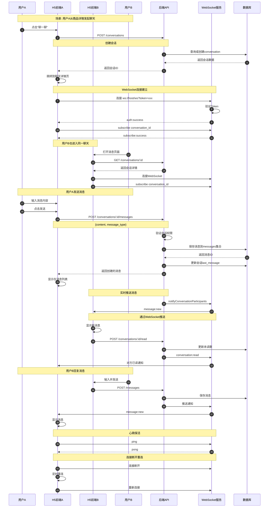

# 在线聊天流程图

## 时序图



## 流程说明

### 1. 发起聊天

**触发场景:**
- 从商品详情页点击"聊一聊"
- 从消息列表点击会话

**API:** `POST /api/web/conversations`

**处理流程:**
1. 检查是否已存在会话
2. 不存在则创建新会话
3. 返回会话ID

### 2. WebSocket连接

**连接地址:** `ws://localhost:3002/ws?token={JWT}`

**连接流程:**
1. 携带Token连接WebSocket
2. 服务端验证Token
3. 返回 `auth:success`
4. 客户端订阅会话 `subscribe`
5. 返回 `subscribe:success`

### 3. 发送消息

**API:** `POST /api/web/conversations/:id/messages`

**请求体:**
```javascript
{
  content: "消息内容",
  message_type: "text",  // text/image/order/location
  image_url: "",         // 图片类型时使用
  payload: {}            // 扩展数据
}
```

**处理流程:**
1. 验证会话权限（是否是买家或卖家）
2. 验证消息内容
3. 保存到 `messages` 集合
4. 更新 `conversations` 的 `last_message`
5. 通过 WebSocket 推送给对方

### 4. 实时推送

**推送类型:**

| 类型 | 说明 |
|------|------|
| `message:new` | 新消息通知 |
| `conversation:read` | 对方已读通知 |
| `auth:success` | 认证成功 |
| `auth:error` | 认证失败 |
| `pong` | 心跳响应 |

### 5. 消息已读

**API:** `POST /api/web/conversations/:id/read`

**处理:**
1. 将会话未读数清零
2. 通过 WebSocket 通知对方

### 6. 心跳保活

**机制:**
- 客户端发送 `ping`
- 服务端返回 `pong`
- 服务端每30秒检测连接状态

### 7. 断线重连

**流程:**
1. 连接断开时触发 `onclose`
2. 定时器延迟2.5秒后重连
3. 重新建立WebSocket连接
4. 重新订阅会话

## 数据库集合

### conversations（会话）
```javascript
{
  id: "conv-xxx",
  listing_id: "关联的商品ID",
  buyer_openid: "买家openid",
  seller_openid: "卖家openid",
  last_message: "最后一条消息预览",
  unread_count: 0,
  created_at: 时间戳,
  updated_at: 时间戳
}
```

### messages（消息）
```javascript
{
  id: "msg-xxx",
  conversation_id: "所属会话ID",
  sender_openid: "发送者openid",
  content: "消息内容",
  message_type: "text/image/order/location",
  image_url: "图片URL",
  status: "sent/read",
  payload: {},  // 扩展数据
  created_at: 时间戳
}
```

## 关键代码位置

| 功能 | 文件路径 |
|------|---------|
| WebSocket服务 | `admin/websocket.js` |
| 消息API | `admin/routes/web-api.js` |
| 前端聊天页面 | `admin/public/user-web/app.js` (MessageDetailPage) |
| 前端消息列表 | `admin/public/user-web/app.js` (MessageIndexPage) |
