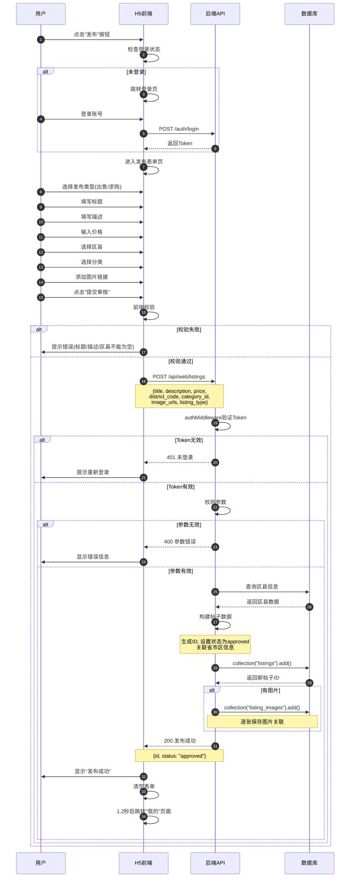

# 商品发布流程图

## 时序图



## 流程说明

### 1. 前置检查
- 用户点击发布按钮
- 前端检查登录状态
- 未登录用户需先登录

### 2. 表单填写
用户需要填写以下信息：
| 字段 | 必填 | 说明 |
|------|------|------|
| 发布类型 | 是 | 出售(sale) / 求购(wanted) |
| 标题 | 是 | 商品标题 |
| 描述 | 是 | 商品详细描述 |
| 价格 | 是 | 商品价格(数字) |
| 区县 | 是 | 选择所属区县 |
| 分类 | 是 | 商品分类(默认"其他") |
| 图片 | 否 | 最多6张图片链接 |

### 3. 前端校验
- 标题、描述、区县不能为空
- 价格必须是有效数字且≥0
- 图片最多6张

### 4. 后端处理
**API端点:** `POST /api/web/listings`

**处理流程:**
1. Token验证(authMiddleware)
2. 参数校验
3. 查询区县信息(获取省市区关联)
4. 构建帖子数据对象
5. 保存到listings集合
6. 如有图片,保存到listing_images集合

### 5. 数据存储

**listings集合:**
```javascript
{
  id: "listing-xxx",
  openid: "用户openid",
  title: "商品标题",
  description: "商品描述",
  price: 100,
  district_code: "区县代码",
  district_name: "区县名称",
  city_code: "城市代码",
  city_name: "城市名称",
  province_code: "省份代码",
  province_name: "省份名称",
  category_id: "分类ID",
  listing_type: "sale/wanted",
  status: "approved",
  review_status: "approved",
  image_urls: ["图片链接1", "图片链接2"],
  created_at: 时间戳,
  updated_at: 时间戳
}
```

**listing_images集合:**
```javascript
{
  id: "image-xxx",
  listing_id: "关联的帖子ID",
  image_url: "图片链接",
  order: 1,
  created_at: 时间戳
}
```

## 关键代码位置

| 功能 | 文件路径 |
|------|---------|
| 前端发布页面 | `admin/public/user-web/app.js` (PublishPage组件) |
| 后端发布API | `admin/routes/web-api.js` (POST /listings) |
| 认证中间件 | `admin/middleware/auth.js` |
| 数据库集合 | `listings`, `listing_images` |
