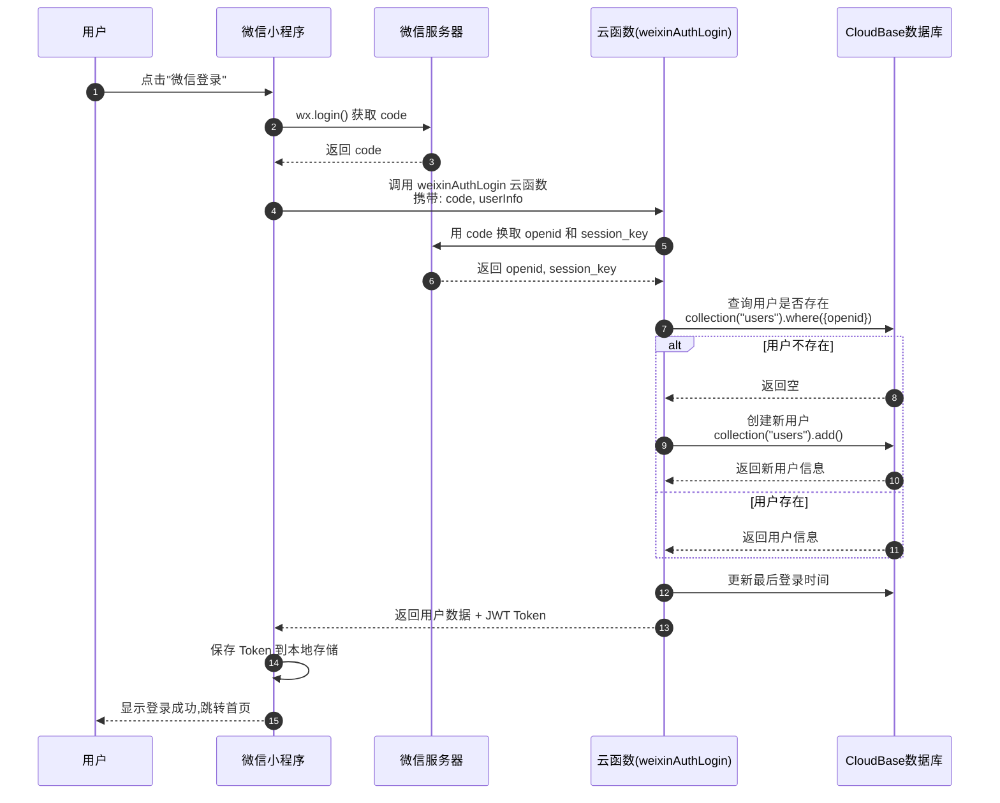
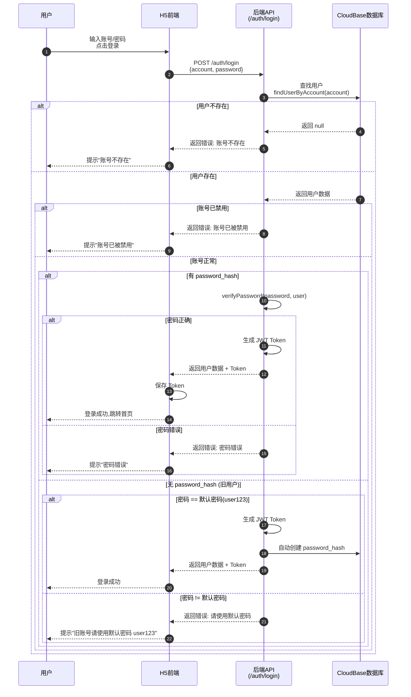
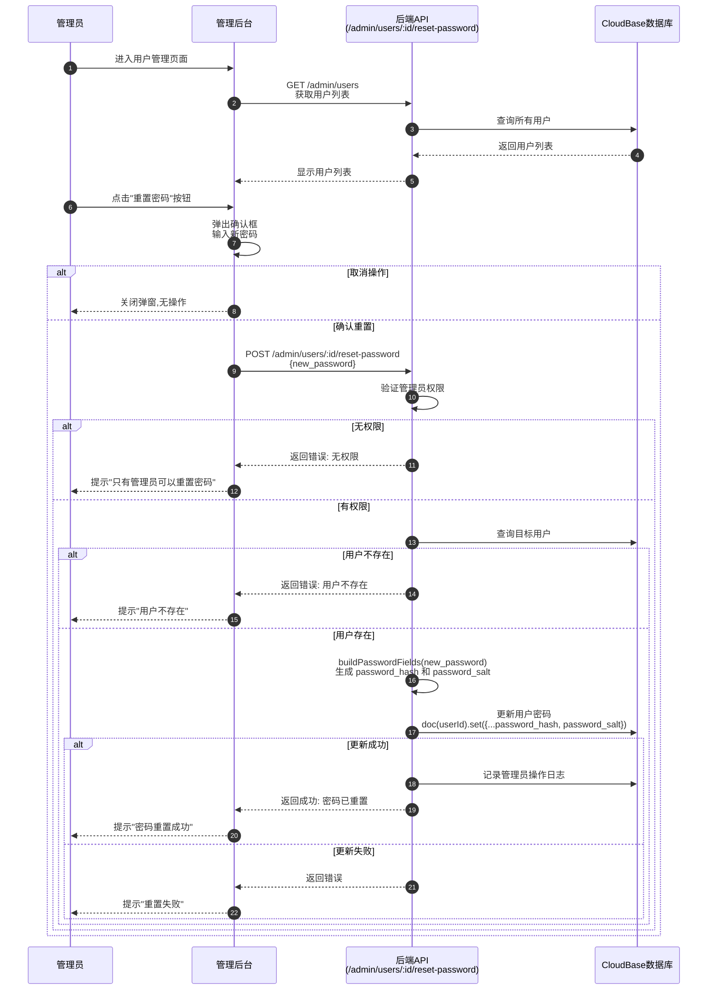
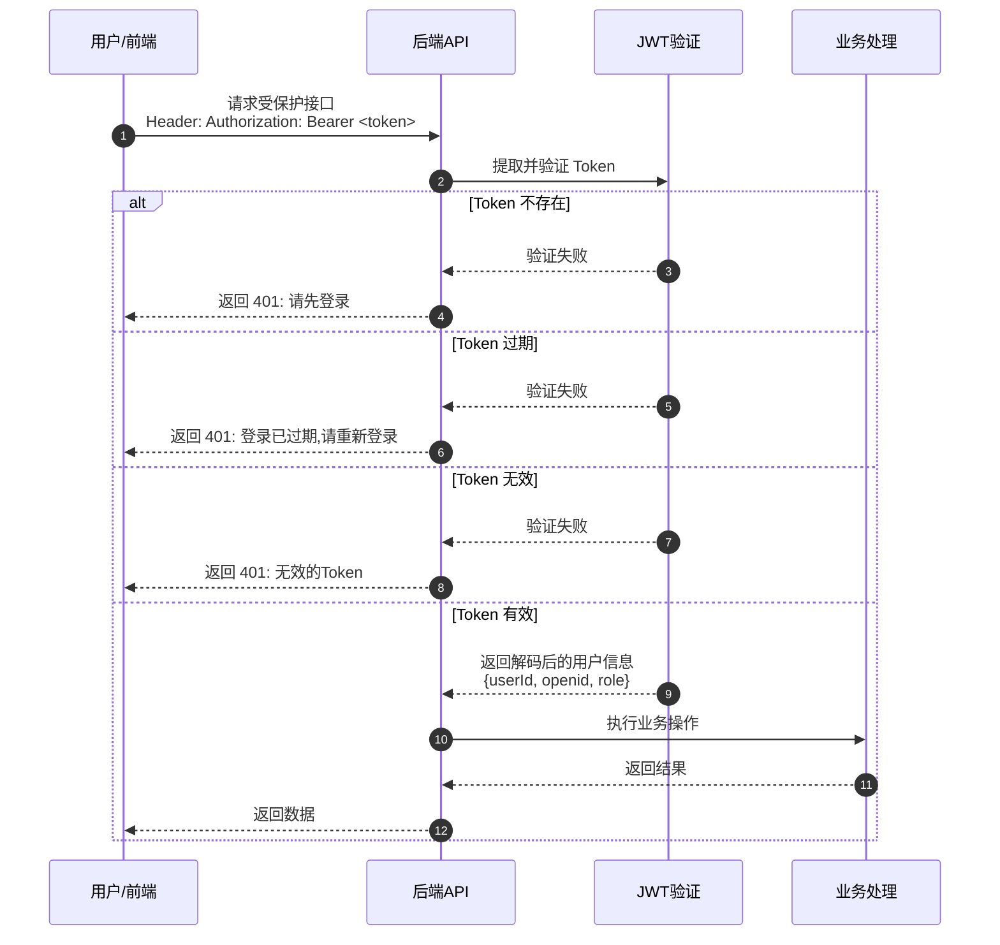
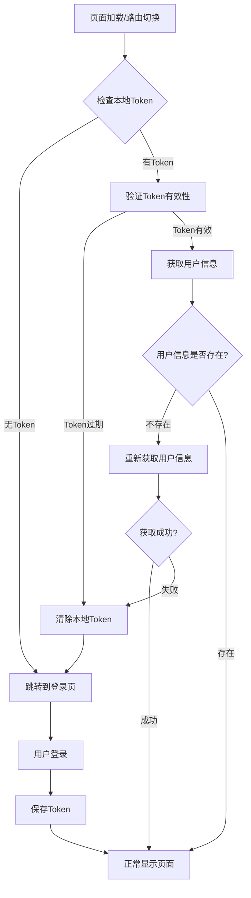

# 用户登录流程图

## 1. 微信小程序登录流程

## 2. 账号密码登录流程 (H5/测试)

## 3. 管理员重置密码流程

## 4. Token 验证流程

## 5. 登录状态检查流程

## 关键代码位置

| 功能 | 文件路径 |
|------|---------|
| 微信登录云函数 | `uniapp-project/cloudfunctions/weixinAuthLogin/index.js` |
| 账号密码登录 API | `admin/routes/web-auth.js` (POST /auth/login) |
| Token 验证中间件 | `admin/middleware/auth.js` |
| 密码重置 API | `admin/routes/admin.js` (POST /users/:id/reset-password) |
| 密码加密工具 | `admin/lib/passwords.js` |
| 前端登录服务 | `uniapp-project/src/services/auth.js` |
