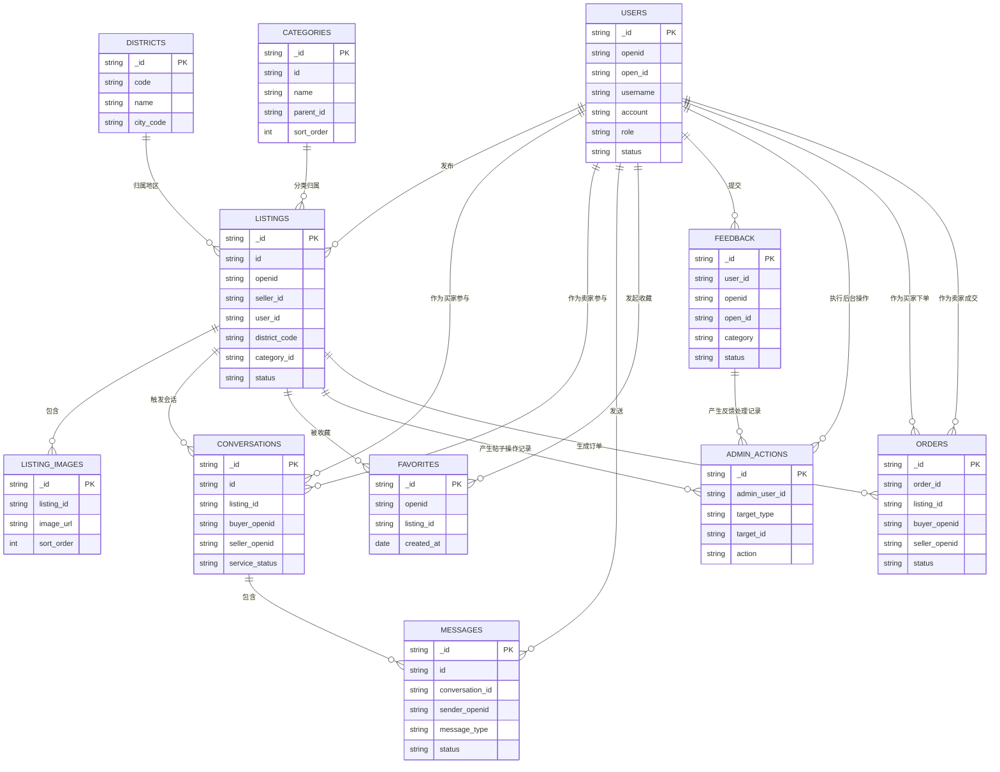

# 3.4.3 数据关系设计

本系统的数据关系设计围绕 `users`、`listings`、`conversations` 三个核心集合展开，`listing_images`、`favorites`、`feedback`、`admin_actions`、`districts`、`categories`、`messages`、`orders` 等集合承担补充和支撑作用。整体关系既能满足前台“发布、浏览、收藏、沟通”的业务需求，也能支撑后台“审核、治理、客服处理”的管理需求。

## 图 3-8 数据关系设计 ER 图

## 图示说明

1. `users - listings` 为一对多关系。一个用户可以发布多个帖子，一个帖子只对应一个发布者。代码中主要通过 `openid`、`open_id`、`seller_id` 或 `user_id` 标识发布者。
2. `users - favorites - listings` 为多对多关系。一个用户可以收藏多个帖子，一个帖子也可以被多个用户收藏，`favorites` 集合承担中间关联作用。
3. `listings - listing_images` 为一对多关系。一个帖子可以对应多张图片，一张图片只属于一个帖子。
4. `listings - conversations` 为一对多关系。一个帖子可能引出多个会话，一个会话只围绕一个帖子展开。
5. `users - conversations` 为多对多业务关系。一个用户可以参与多个会话，一个会话同时关联买家与卖家两个用户。
6. `conversations - messages` 为一对多关系。一个会话下可以包含多条消息，一条消息只归属于一个会话。
7. `users - messages` 为一对多关系。一个用户可以发送多条消息，每条消息只对应一个发送者。
8. `users - feedback` 为一对多关系。一个用户可提交多条反馈，一条反馈通常只对应一个用户。
9. `users - admin_actions`、`listings - admin_actions`、`feedback - admin_actions` 分别构成后台治理链路，用于记录管理员或客服对帖子、反馈等对象的处理行为。
10. `orders` 集合已经建立了与 `users`、`listings` 的关联关系，用于订单记录预留，但“我的订单”“我卖出的”“担保支付”业务流程当前仍未完整实现。

## 表 3-4 主要数据关系说明表

| 关联数据集合 | 关系类型 | 关系说明 | 代码实现说明 |
| --- | --- | --- | --- |
| users - listings | 一对多 | 一个使用者可以发布多个帖子，一个帖子只属于一个发布使用者 | `listings` 集合通过 `openid`、`open_id`、`seller_id` 或 `user_id` 标识发布者，前台“我的发布”和后台帖子管控均基于该关系实现 |
| districts - listings | 一对多 | 一个地区下可以存在多个帖子，一个帖子只属于一个地区 | `listings` 集合通过 `district_code` 关联 `districts` 集合，用于首页筛选、分类筛选和发布归属定位 |
| categories - listings | 一对多 | 一个分类下可以包含多个帖子，一个帖子通常归属于一个分类 | 分类数据由 `categories` 集合提供，帖子通过 `category_id` 或业务分类字段与分类数据形成关联，用于首页和分类页筛选 |
| listings - listing_images | 一对多 | 一个帖子可对应多张图片，一张图片只属于一个帖子 | `listing_images` 集合通过 `listing_id` 关联 `listings`，用于补充帖子多图展示和后台图片明细管控 |
| listings - conversations | 一对多 | 一个帖子可产生多个会话，一个会话只围绕一个帖子展开 | `conversations` 集合通过 `listing_id` 关联 `listings`，买卖双方围绕同一帖子建立沟通关系 |
| users - conversations | 多对多 | 一个使用者可参与多个会话，一个会话包含买卖双方两个使用者 | `conversations` 集合通过 `buyer_openid` 和 `seller_openid` 关联 `users` 集合，实现买家与卖家的双向会话关系 |
| conversations - messages | 一对多 | 一个会话包含多条消息，一条消息只属于一个会话 | `messages` 集合通过 `conversation_id` 关联 `conversations`，用于保存具体聊天记录 |
| users - messages | 一对多 | 一个使用者可以发送多条消息，一条消息只对应一个发送者 | `messages` 集合通过 `sender_openid` 标识消息发送者，支撑聊天发送与消息归属判断 |
| users - favorites - listings | 多对多 | 一个使用者可以收藏多个帖子，一个帖子也可以被多个使用者收藏 | `favorites` 集合通过 `openid` 和 `listing_id` 建立使用者与帖子之间的收藏关系，用于收藏和取消收藏功能 |
| users - feedback | 一对多 | 一个使用者可以提交多条反馈，一条反馈通常对应一个使用者 | `feedback` 集合通过 `user_id`、`openid` 或 `open_id` 关联使用者，用于意见反馈与举报处理 |
| users - admin_actions | 一对多 | 一个管理员或客服可以产生多条后台操作记录，一条操作记录只对应一个操作人 | `admin_actions` 集合通过 `admin_user_id` 记录操作人员身份，用于后台审计与追踪 |
| listings - admin_actions | 一对多 | 一个帖子可对应多条后台处理记录，一条操作记录只针对一个帖子 | 在帖子审核、下架、恢复等后台操作中，`admin_actions` 通过 `target_type` 和 `target_id` 记录对应帖子 |
| feedback - admin_actions | 一对多 | 一条反馈可对应多次后台处理记录，一条操作记录只针对一个反馈对象 | 在反馈状态更新过程中，系统通过 `admin_actions` 记录处理过程和操作说明 |
| listings - orders | 一对多 | 一个帖子理论上可生成订单记录，单条订单对应一个帖子 | `orders` 集合通过 `listing_id` 关联 `listings`，当前主要用于订单记录预留 |
| users - orders | 一对多 | 一个用户可作为买家或卖家参与多条订单，一条订单同时关联买卖双方 | `orders` 集合通过 `buyer_openid` 和 `seller_openid` 关联 `users`，但相关前台业务页面暂未完全实现 |

