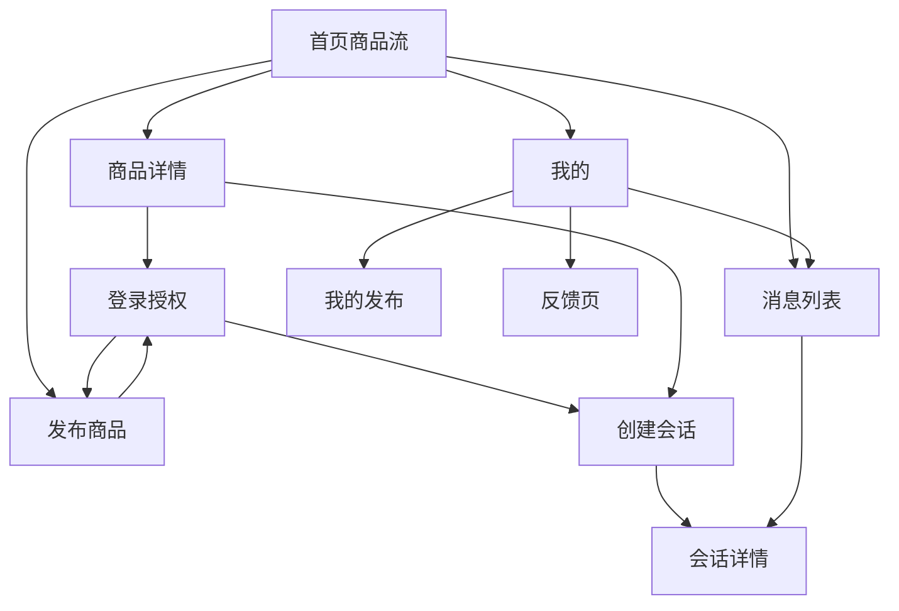
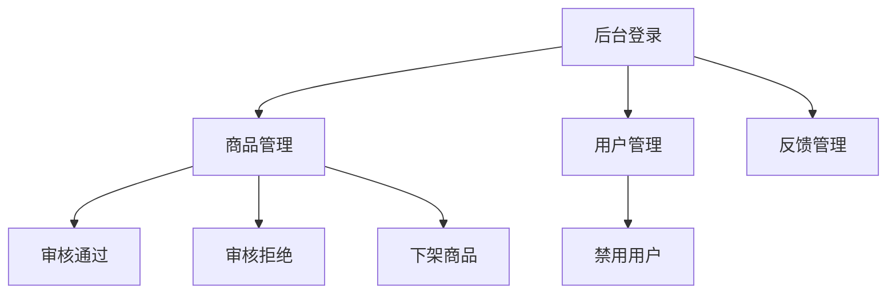

# 本地二手交易 MVP 接口清单与页面流转

## 接口设计原则

- 只提供支撑 P0 闭环的最小接口
- 接口按业务能力分组
- 优先适配云函数或轻量后端
- 命名保持稳定，便于前后端并行

## 一、用户与认证

### 1. 微信登录

- `POST /api/auth/wechat-login`
- 入参：
  - `code`
  - `userInfo`
- 出参：
  - `token`
  - `user`

### 2. 获取当前用户

- `GET /api/me`
- 出参：
  - `id`
  - `nickname`
  - `avatar_url`
  - `role`
  - `status`

## 二、区县与基础配置

### 1. 获取可用城市和区县

- `GET /api/districts`
- 查询参数：
  - `city_code` 可选
- 出参：
  - 城市列表
  - 区县列表

## 三、商品

### 1. 发布商品

- `POST /api/listings`
- 入参：
  - `title`
  - `description`
  - `price`
  - `district_code`
  - `image_urls`
- 出参：
  - `listing_id`
  - `status`

### 2. 获取商品列表

- `GET /api/listings`
- 查询参数：
  - `district_code`
  - `keyword`
  - `page`
  - `page_size`
- 出参：
  - `items`
  - `total`

### 3. 获取商品详情

- `GET /api/listings/{listing_id}`
- 出参：
  - 商品主体
  - 图片列表
  - 卖家基础信息

### 4. 获取我的发布

- `GET /api/my/listings`
- 查询参数：
  - `status` 可选
- 出参：
  - 我的商品列表

### 5. 更新商品状态

- `POST /api/my/listings/{listing_id}/status`
- 入参：
  - `status`
- 说明：
  - MVP 可只支持用户查看，不强制实现编辑和删除

## 四、会话与消息

### 1. 发起联系 / 创建会话

- `POST /api/conversations`
- 入参：
  - `listing_id`
  - `first_message`
- 出参：
  - `conversation_id`

### 2. 获取我的会话列表

- `GET /api/conversations`
- 出参：
  - 会话列表
  - 最近消息
  - 未读数

### 3. 获取会话详情

- `GET /api/conversations/{conversation_id}`
- 出参：
  - 会话信息
  - 商品摘要
  - 消息列表

### 4. 发送消息

- `POST /api/conversations/{conversation_id}/messages`
- 入参：
  - `content`
- 出参：
  - 消息对象

### 5. 标记消息已读

- `POST /api/conversations/{conversation_id}/read`
- 出参：
  - 成功标记结果

## 五、反馈

### 1. 提交反馈

- `POST /api/feedback`
- 入参：
  - `category`
  - `content`
  - `contact_info`
- 出参：
  - `feedback_id`

## 六、后台接口

### 1. 商品审核列表

- `GET /admin/api/listings`
- 查询参数：
  - `review_status`
  - `keyword`
  - `page`

### 2. 审核通过商品

- `POST /admin/api/listings/{listing_id}/approve`

### 3. 拒绝商品

- `POST /admin/api/listings/{listing_id}/reject`
- 入参：
  - `reason`

### 4. 下架商品

- `POST /admin/api/listings/{listing_id}/remove`

### 5. 用户列表

- `GET /admin/api/users`

### 6. 禁用用户

- `POST /admin/api/users/{user_id}/disable`

### 7. 反馈列表

- `GET /admin/api/feedback`

## 七、埋点事件

客户端至少记录以下事件：

- `login_success`
- `listing_created`
- `listing_review_approved`
- `listing_viewed`
- `contact_started`
- `seller_replied`
- `feedback_submitted`

## 页面流转图

## 管理后台流转图

## 核心闭环时序

### 1. 发布闭环

1. 用户登录
2. 选择区县
3. 上传图片
4. 提交商品
5. 商品进入待审核
6. 后台审核通过
7. 商品出现在首页列表

### 2. 浏览联系闭环

1. 买家进入首页
2. 按区县筛选或搜索
3. 打开商品详情
4. 点击联系卖家
5. 创建会话并发送首条消息
6. 卖家进入消息页查看并回复

### 3. 后台管理闭环

1. 管理员登录后台
2. 查看待审核商品
3. 审核通过或拒绝
4. 如发现违规内容，执行下架
5. 如发现违规用户，执行禁用

## 接口验收优先级

### P0 必须先通

- `/api/auth/wechat-login`
- `/api/districts`
- `/api/listings`
- `/api/listings/{listing_id}`
- `/api/conversations`
- `/api/conversations/{conversation_id}/messages`
- `/admin/api/listings/{listing_id}/approve`

### P0 第二批补齐

- `/api/my/listings`
- `/api/conversations`
- `/api/conversations/{conversation_id}/read`
- `/api/feedback`
- `/admin/api/users/{user_id}/disable`

## 联调检查建议

在前后端联调阶段，优先验证以下路径：

1. 登录接口是否返回有效用户身份
2. 发布商品后是否写入数据库
3. 审核通过后首页是否能拉到商品
4. 商品详情页是否能正确展示卖家和图片区
5. 发起会话后是否创建 `conversation`
6. 发消息后是否写入 `messages`
7. 卖家登录后是否能看到买家消息
