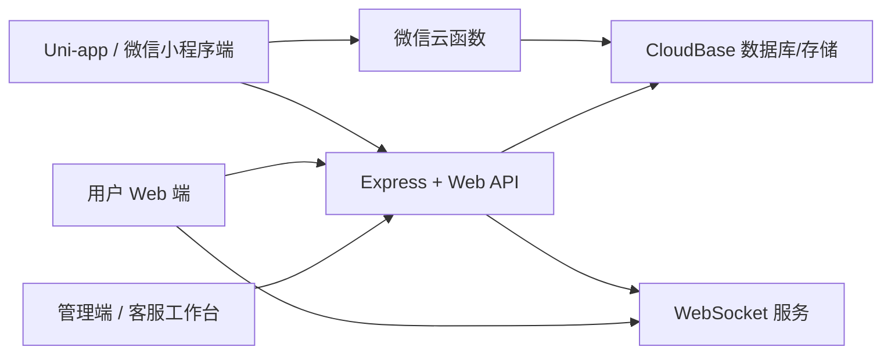
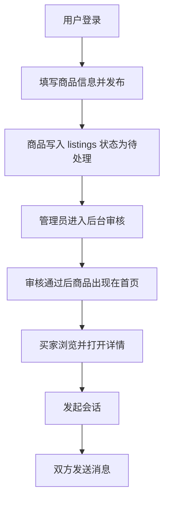

# 基于微信云开发的校园二手交易平台多端系统的设计与实现

## 摘要

随着高校学生闲置物品流转需求的不断增长，传统依赖微信群、QQ群和线下公告栏的二手交易方式逐渐暴露出信息分散、信任不足、管理困难和沟通效率低等问题。针对上述问题，本文结合校园二手交易场景，设计并实现了一套基于微信云开发的校园二手交易平台多端系统。该系统以微信生态为主要业务入口，同时兼顾 Web 端访问和后台管理需求，形成了“用户端小程序/Uni-app + 用户端 Web + 管理端 Web + 客服工作台”的多端协同方案。

本文首先从校园二手交易的业务特点出发，对普通用户、管理员和客服三类角色的功能需求进行分析，并在此基础上完成系统总体架构、数据库结构、接口规范与安全机制设计。在实现层面，系统管理端采用 Node.js、Express 与 EJS 构建，用户 Web 端采用 Vue 组合式开发方式实现，Uni-app 端保留了微信小程序运行能力，并通过微信授权登录、CloudBase 数据能力和云函数实现移动端业务闭环。后端统一对接 CloudBase 数据库与存储资源，围绕用户、区县、分类、商品、会话、消息、反馈、管理操作等核心集合组织业务数据。系统进一步引入 JWT 身份认证、基于 `pbkdf2` 的密码摘要、WebSocket 实时消息推送和图片上传约束机制，以提升系统安全性与交互体验。

从项目当前实现结果来看，系统已支持账号登录、区县筛选、商品浏览、商品发布、收藏管理、站内会话、消息发送、后台审核、用户禁用、反馈处理及客服工作台等核心功能，能够满足校园二手交易平台最小可用闭环的建设目标。本文的研究与实现表明，基于微信云开发与轻量化 Node.js 服务组合的方案，能够较好地兼顾开发效率、部署成本与后续扩展能力，对校园本地化二手交易平台的建设具有一定参考价值。

**关键词**：微信云开发；Uni-app；校园二手交易；Web 管理端；实时消息

## Abstract

With the increasing demand for second-hand trading among college students, traditional approaches based on chat groups and offline bulletin boards are facing problems such as scattered information, weak trust, low management efficiency, and poor communication experience. To address these issues, this paper designs and implements a multi-end campus second-hand trading platform based on WeChat CloudBase. The system takes the WeChat ecosystem as its core access channel while supporting Web access and back-office administration, forming a collaborative architecture including a Uni-app mini program, a user-facing Web application, an admin Web system, and a customer-service dashboard.

This paper first analyzes the business characteristics of campus second-hand trading and the functional requirements of normal users, administrators, and customer-service staff. Based on these requirements, the overall architecture, database schema, API design, and security mechanism are completed. In implementation, the admin system is built with Node.js, Express, and EJS, the user Web client is implemented with Vue, and the Uni-app client retains WeChat mini-program capabilities through WeChat authorization, CloudBase data services, and cloud functions. The backend is connected to CloudBase database and storage, with core entities such as users, districts, categories, listings, conversations, messages, feedback, and admin actions. JWT authentication, password hashing with `pbkdf2`, WebSocket-based real-time messaging, and image upload restrictions are introduced to improve security and user experience.

According to the current repository implementation, the system supports account login, district-based filtering, listing browsing, listing publishing, favorites management, in-site conversations, message sending, admin review, user disabling, feedback processing, and customer-service dashboard functions. It can satisfy the minimum viable closed loop of a campus second-hand trading platform. The research shows that the combination of WeChat CloudBase and lightweight Node.js services can balance development efficiency, deployment cost, and future extensibility, which provides practical reference for the construction of localized campus second-hand trading systems.

**Keywords**: WeChat CloudBase; Uni-app; campus second-hand trading; Web admin; real-time messaging

## 第1章 绪论

### 1.1 研究背景

高校校园内部具有明显的二手交易需求。一方面，学生在毕业、换宿舍、更新电子设备或教材更替时，会产生大量仍可使用的闲置物品；另一方面，校内用户对于低价、近距离和可当面交易的商品有持续需求。相较于社会化综合电商平台，校园场景具有用户范围相对集中、交易半径较小、信息时效性要求更高等特点，因此更适合构建本地化、轻量化的二手交易平台。

在现实使用过程中，校园二手交易通常依赖微信群、QQ群、朋友圈或学校论坛进行信息发布。这种方式虽然门槛较低，但也存在明显不足：其一，商品信息格式不统一，搜索与筛选能力差；其二，缺乏审核和违规处理机制，容易出现虚假信息；其三，沟通和交易记录分散，后续追踪困难；其四，管理员无法高效查看用户反馈与商品状态，平台难以形成规范运营。因此，设计一套贴合校园场景的数字化二手交易平台具有较强现实意义。

### 1.2 研究意义

本课题的研究意义主要体现在三个方面。

第一，从应用价值来看，平台能够帮助学生更便捷地处理闲置物品，提高物品复用率，降低交易成本，促进校园内部绿色消费与资源循环。

第二，从工程实践来看，本项目同时覆盖微信小程序、Uni-app、Web 用户端和 Web 管理端，涉及前后端协同、云开发接入、实时消息、安全认证和后台审核等多个典型模块，具有较强的综合训练价值。

第三，从技术路线来看，系统采用微信云开发与轻量 Node.js 服务协同的方案，既保留了云开发低运维成本的优势，又兼顾了 Web 端扩展、后台管理和接口统一的要求，为同类校园平台建设提供了可借鉴的实现思路。

### 1.3 研究内容

围绕校园二手交易场景，本文完成了以下几个方面的工作：

1. 分析校园二手交易平台的业务流程和角色需求，明确普通用户、管理员和客服三类主体的核心任务。
2. 设计系统多端总体架构，划分用户 Web 端、Uni-app 小程序端、管理后台与客服工作台的职责边界。
3. 设计数据库结构与接口规范，建立用户、商品、会话、消息、反馈、管理操作等核心数据模型。
4. 实现商品发布、浏览、审核、收藏、站内聊天、反馈管理、用户权限控制等主要功能。
5. 结合现有测试脚本和核心流程，对系统功能完整性与工程可用性进行分析总结。

### 1.4 论文结构

本文共分为七章，内容安排如下：

1. 第1章为绪论，阐述课题背景、研究意义、研究内容与论文结构。
2. 第2章介绍系统开发所采用的关键技术与运行环境。
3. 第3章从业务场景出发进行需求分析，并对项目文件结构进行系统梳理。
4. 第4章完成系统总体设计，包括架构设计、数据设计、接口设计与安全设计。
5. 第5章结合代码实现说明用户端、管理端、Uni-app 端和实时消息模块的实现过程。
6. 第6章对系统测试方案、关键测试点与现有局限进行总结分析。
7. 第7章给出全文总结与后续优化方向。

## 第2章 相关技术与开发环境

### 2.1 Uni-app 技术

Uni-app 是一种基于 Vue 语法的跨端开发框架，能够面向 H5、微信小程序等多种运行环境生成应用。在本项目中，`uniapp-project` 目录为移动端与小程序端实现主体，其 `package.json` 中引入了 `@dcloudio/uni-app`、`@dcloudio/uni-mp-weixin`、`@dcloudio/vite-plugin-uni` 以及 Vue 3 相关依赖。系统通过 `pages.json` 定义页面路由，覆盖首页、分类、商品详情、发布、消息、收藏、个人中心和登录等页面，满足用户端最小闭环需求。

相较于直接编写原生微信小程序，Uni-app 具有统一页面组织方式和更好的跨端扩展能力，便于同一套业务逻辑在 H5 和小程序环境中复用。对于毕业设计这类功能较完整但迭代周期有限的项目而言，Uni-app 能够有效降低开发成本。

### 2.2 微信云开发与 CloudBase

微信云开发为小程序提供数据库、存储、云函数等后端能力，能够简化传统服务端与数据库的部署流程。本项目中，`cloudbase.js` 负责初始化 CloudBase Node SDK，系统后端通过 `@cloudbase/node-sdk` 与云数据库建立连接；`uniapp-project/src/utils/cloudbase.js` 则负责在小程序环境中初始化 `wx.cloud` 能力。

项目还在 `uniapp-project/cloudfunctions/weixinAuthLogin/index.js` 中实现了基于云函数的微信授权登录逻辑，用于在小程序端获取用户身份、构造用户对象并返回登录令牌。通过这一方式，平台可以在保持微信生态接入优势的同时，减少传统服务器侧身份对接的复杂度。

### 2.3 Node.js、Express 与 EJS

虽然课题场景以微信云开发为基础，但结合项目实际需求，仅依靠小程序云函数难以同时满足后台管理、客服工作台和用户 Web 端的统一接口接入要求。因此，本系统采用了 Express 作为轻量服务端框架，在 `admin/server.js` 中统一挂载后台路由、用户 Web API、微信小程序认证 API 与 WebSocket 服务。

管理端页面采用 EJS 模板引擎实现。`admin/views` 目录中包含登录页、商品管理页、用户管理页、反馈管理页和客服工作台页面。这种实现方式结构简单、部署方便，适用于本项目中以业务管理和状态操作为主的后台场景。

### 2.4 JWT、WebSocket 与文件上传

为保障用户 Web API 的鉴权安全，项目在 `admin/routes/web-auth.js` 与 `admin/routes/web-api.js` 中使用 JWT 进行用户身份签发与校验，并结合 `crypto.pbkdf2Sync` 完成密码摘要存储，避免明文密码直接写入数据库。

系统消息模块通过 `admin/websocket.js` 提供 WebSocket 服务。客户端连接时携带 JWT 令牌，服务端完成身份校验后允许订阅指定会话，从而在消息发送与已读状态更新时向买卖双方推送事件通知，改善沟通体验。

在图片上传方面，Web 端通过 `multer` 将商品图片和聊天图片存入 `admin/public/uploads`，而 Uni-app 端在微信环境下则可以调用云开发上传能力将文件写入云存储。这种双通路设计提升了多端兼容性。

### 2.5 开发环境

结合仓库中的配置文件与依赖清单，系统开发环境可归纳如下：

| 项目 | 说明 |
| --- | --- |
| 开发语言 | JavaScript、Vue 单文件组件、EJS |
| 服务端运行环境 | Node.js |
| 前端框架 | Vue 3、Uni-app |
| 服务端框架 | Express |
| 数据服务 | 微信云开发 CloudBase |
| 身份认证 | JWT、微信授权登录 |
| 实时通信 | WebSocket |
| 构建工具 | Vite |
| 主要运行目录 | `admin`、`uniapp-project` |

## 第3章 需求分析与项目结构梳理

### 3.1 业务角色分析

系统主要包含三类业务角色。

1. 普通用户：用于浏览商品、筛选区县、收藏商品、发布出售帖或求购帖、发起会话和提交反馈。
2. 管理员：用于审核商品、拒绝违规帖子、下架商品、恢复商品、禁用用户、设置客服角色以及查看平台反馈。
3. 客服人员：用于查看会话活跃情况、处理待办反馈、辅助平台运营。

三类角色的存在使系统不再只是一个简单的信息展示工具，而是形成了包含用户交易、平台审核与运营支持的完整业务闭环。

### 3.2 功能需求分析

#### 3.2.1 用户端功能需求

用户端功能围绕“发布商品 - 浏览商品 - 发起联系 - 完成沟通”的最小闭环展开，主要包括：

1. 登录与注册：支持 Web 账号密码登录，也支持小程序微信授权登录。
2. 区县筛选：按省、市、区县三级结构定位本地交易范围。
3. 商品浏览：展示审核通过的商品列表，支持关键词检索与分类浏览。
4. 商品详情：显示商品标题、价格、区县、图片、卖家昵称等信息。
5. 商品发布：支持发布出售帖与求购帖，并提交图片、价格、区县与分类信息。
6. 收藏管理：将感兴趣的商品加入个人收藏，方便后续联系。
7. 会话消息：买家可发起会话，双方可在站内持续发送文本或图片消息。
8. 个人中心：查看我的发布、我的消息、我的收藏以及账户基本信息。
9. 反馈提交：用户可向平台提交 bug、建议或投诉类反馈。

#### 3.2.2 管理端功能需求

后台管理是保障平台正常运行的重要环节，其核心功能包括：

1. 后台登录：管理员和客服通过独立后台入口登录。
2. 商品审核：查看商品列表、进入详情、执行拒绝、下架与恢复操作。
3. 用户管理：查看用户状态并执行禁用、恢复和角色调整。
4. 反馈管理：查看反馈详情并修改处理状态。
5. 审计记录：将管理行为写入 `admin_actions` 集合，以便后续追溯。

#### 3.2.3 客服工作台需求

项目在管理员后台之外还加入了客服工作台，其目标不是做复杂客服系统，而是为运营过程提供轻量支持。客服界面主要用于查看近期会话、平台消息量、待处理反馈数量与反馈处理状态，帮助平台快速发现问题并完成人工跟进。

### 3.3 非功能需求分析

除功能性需求外，系统还应满足以下非功能需求：

1. 易用性：界面应尽量简洁，用户能够在较少学习成本下完成登录、发布和沟通。
2. 安全性：后台与用户端接口应具备角色鉴权、密码保护、状态校验和上传限制。
3. 可扩展性：数据结构应为后续订单、支付、评价、举报等功能预留空间。
4. 兼容性：系统既要支持 Web 浏览器访问，也要支持微信小程序端运行。
5. 可维护性：代码目录应清晰划分，业务文档、初始化脚本和测试脚本应具备明确位置。

### 3.4 项目文件结构梳理

根据 `g:/bishe2` 当前仓库结构，项目可分为运行主体、数据与脚本、设计文档和参考资源四部分。实际运行核心不在全部目录平均分布，而是集中在 `admin` 与 `uniapp-project` 两个目录中。

#### 3.4.1 根目录关键文件

| 路径 | 作用 |
| --- | --- |
| `package.json` | 根级脚本入口，负责启动后台、初始化数据库、设置管理员等任务 |
| `cloudbase.js` | CloudBase Node SDK 初始化 |
| `init-db.js` | 集合创建、区县与分类数据初始化 |
| `seed-test-data.js` | 测试数据注入脚本 |
| `query-users.js` | 查询用户信息，辅助管理员配置 |
| `set-admin-role.js` | 将指定用户设为管理员 |
| `scripts/crawl-china-districts.js` | 抓取与整理区县数据 |
| `data/china-districts.generated.js` | 区县静态数据快照 |

#### 3.4.2 管理端 `admin` 目录

`admin` 是项目当前最重要的服务端目录，既承载后台管理端，也承载用户 Web 端和 WebSocket 服务。

| 子目录或文件 | 说明 |
| --- | --- |
| `server.js` | Express 服务主入口 |
| `routes/admin.js` | 商品、用户、反馈管理路由 |
| `routes/service.js` | 客服工作台路由 |
| `routes/web-auth.js` | 用户 Web 登录认证 |
| `routes/web-api.js` | 用户 Web 业务 API |
| `routes/mp-auth.js` | 微信小程序登录与手机号授权接口 |
| `websocket.js` | WebSocket 实时通信实现 |
| `views/*` | 后台与客服 EJS 页面 |
| `public/user-web/*` | 用户 Web 端单页应用静态资源 |
| `public/uploads/*` | 商品图片和聊天图片存储目录 |

其中，`admin/views` 下共包含 10 个核心模板文件，覆盖登录、商品列表、商品详情、用户管理、反馈管理、客服工作台以及异常页面。`admin/public/user-web` 则包含 `index.html`、`app.js`、`styles.css` 等用户 Web 端资源。

#### 3.4.3 用户端 `uniapp-project` 目录

`uniapp-project` 为小程序与跨端用户前端目录，是最贴近微信云开发原始设计路线的部分。

| 子目录或文件 | 说明 |
| --- | --- |
| `src/pages/*` | 用户页面，包括首页、分类、详情、发布、消息、收藏、我的、登录 |
| `src/services/api.js` | 用户端接口封装，支持 Web API、Mock 与 CloudBase 三种接入方式 |
| `src/services/auth.js` | 登录与鉴权逻辑 |
| `src/utils/cloudbase.js` | 小程序端 CloudBase 初始化和上传工具 |
| `cloudfunctions/weixinAuthLogin` | 微信授权登录云函数 |
| `pages.json` | 页面与 tabBar 配置 |

项目现有页面共 9 个，覆盖小程序/移动端完整用户闭环。

#### 3.4.4 文档与参考资源

`docs/mvp` 和 `docs/execution/outputs` 中保存了页面清单、数据模型、接口设计及执行过程文档，这些内容对于梳理系统需求和架构设计具有直接价值。

需要说明的是，`admin/temp_crmeb` 目录规模较大，但其更接近外部引入的参考商城工程，并非当前项目实际运行核心，因此在本文系统实现分析中不作为主干模块展开。

## 第4章 系统设计

### 4.1 总体架构设计

结合代码实现，系统总体架构采用“多端前端 + 统一服务入口 + CloudBase 数据底座”的方式构建。其核心思想是：用户端可通过 Web 或微信小程序进入系统，后台管理端和客服工作台通过 Express 渲染页面完成管理操作，业务数据统一落到 CloudBase 数据库中。



这种架构有三个优点。第一，用户侧入口丰富，小程序端与 Web 端可面向不同场景提供服务；第二，后台与用户侧接口得到统一治理，方便权限控制和日志记录；第三，数据库和静态资源管理由 CloudBase 负责，降低了单独部署数据库的运维压力。

### 4.2 模块划分设计

系统按照功能可分为四个模块。

1. 用户展示与交易模块：负责首页商品流、分类浏览、商品详情、商品发布、收藏与个人中心。
2. 会话与沟通模块：负责创建会话、拉取消息、发送消息、已读更新和实时通知。
3. 后台管理模块：负责商品审核、用户状态维护、反馈查看和角色调整。
4. 基础支撑模块：负责登录认证、区县与分类基础数据、图片上传、数据初始化和日志记录。

### 4.3 数据库设计

结合 `init-db.js` 和 `docs/mvp/02-data-model.md`，系统核心集合包括 `users`、`districts`、`categories`、`listings`、`listing_images`、`conversations`、`messages`、`feedback`、`admin_actions` 与 `orders`。其中前九个集合已构成主要业务闭环，`orders` 用于为后续交易确认场景预留扩展空间。

#### 4.3.1 用户表设计

`users` 集合用于保存用户身份、昵称、角色、状态、手机号与默认地区等信息。普通用户、管理员和客服均存储于同一集合中，通过 `role` 字段进行区分，通过 `status` 字段控制账号是否可继续使用。

#### 4.3.2 商品与图片区设计

`listings` 为商品主体集合，记录商品标题、描述、价格、区县、分类、状态、浏览量、联系次数等信息；`listing_images` 集合记录图片与商品的一对多关系。项目同时支持出售帖与求购帖两种类型，通过 `listing_type` 字段进行区分。

#### 4.3.3 会话与消息设计

`conversations` 集合用于保存商品会话关系，包括商品编号、买家、卖家、最后一条消息、未读数和更新时间等信息；`messages` 集合则记录每条消息内容、类型、发送者和发送时间。两者配合实现一对多消息结构。

#### 4.3.4 平台治理数据设计

`feedback` 用于保存用户问题反馈，便于平台人工处理；`admin_actions` 用于记录审核、禁用、状态修改等后台动作，为管理操作提供追踪依据。

#### 4.3.5 主要数据结构示意

| 集合名 | 关键字段 | 主要作用 |
| --- | --- | --- |
| `users` | `openid`、`nickname`、`role`、`status` | 用户身份与权限管理 |
| `districts` | `code`、`city_code`、`province_code` | 地区筛选与发布归属 |
| `categories` | `id`、`name`、`sort_order` | 商品分类管理 |
| `listings` | `title`、`price`、`district_code`、`status` | 商品主体 |
| `listing_images` | `listing_id`、`image_url` | 商品图片 |
| `conversations` | `listing_id`、`buyer_openid`、`seller_openid` | 会话关系 |
| `messages` | `conversation_id`、`sender_openid`、`content` | 站内消息 |
| `feedback` | `category`、`content`、`status` | 用户反馈 |
| `admin_actions` | `target_type`、`target_id`、`action` | 管理日志 |
| `orders` | `order_id`、`listing_id`、`status` | 订单预留结构 |

### 4.4 接口设计

从 `admin/routes/web-api.js`、`admin/routes/web-auth.js` 和 `admin/routes/mp-auth.js` 的实现可以看出，系统接口主要分为三类：

1. 用户 Web 认证接口：如 `/api/web/auth/login`、`/api/web/auth/register`、`/api/web/auth/me`。
2. 用户业务接口：如 `/api/web/listings`、`/api/web/me/listings`、`/api/web/conversations`、`/api/web/favorites`、`/api/web/uploads/listing` 等。
3. 微信小程序认证接口：如 `/api/mp/auth/login`、`/api/mp/auth/phone`、`/api/mp/auth/me`。

按业务流程进一步细分，系统的关键接口可概括如下：

| 功能 | 接口 |
| --- | --- |
| 用户登录 | `POST /api/web/auth/login` |
| 用户注册 | `POST /api/web/auth/register` |
| 获取当前用户 | `GET /api/web/auth/me` |
| 获取区县列表 | `GET /api/web/districts` |
| 获取分类列表 | `GET /api/web/categories` |
| 获取商品列表 | `GET /api/web/listings` |
| 获取商品详情 | `GET /api/web/listings/:id` |
| 创建商品 | `POST /api/web/listings` |
| 获取我的商品 | `GET /api/web/me/listings` |
| 更新商品状态 | `PATCH /api/web/me/listings/:id/status` |
| 打开会话 | `POST /api/web/conversations/open` |
| 获取会话列表 | `GET /api/web/conversations` |
| 获取消息列表 | `GET /api/web/conversations/:id/messages` |
| 发送消息 | `POST /api/web/conversations/:id/messages` |
| 收藏切换 | `POST /api/web/favorites/toggle` |
| 聊天图片上传 | `POST /api/web/uploads/chat` |

### 4.5 安全与权限设计

系统安全设计主要体现在以下方面：

1. 后台使用会话机制保护页面访问，并对管理员、客服进行角色区分。
2. 用户 Web API 采用 JWT 作为认证载体，通过请求头携带令牌并在中间件中完成用户状态校验。
3. 用户密码在服务端通过 `pbkdf2` 加盐哈希后存储，提高口令安全性。
4. 被禁用用户在 Web API 中会被直接拒绝访问，从而阻断其发布和发消息行为。
5. 图片上传采用文件类型白名单与大小限制策略，降低恶意上传风险。
6. WebSocket 连接建立前必须通过 JWT 完成身份验证，保证实时通道仅面向合法用户开放。

## 第5章 系统实现

### 5.1 基础环境与数据初始化实现

系统基础环境由根目录脚本负责组织。`cloudbase.js` 读取 `.env` 中的 `CLOUDBASE_ENV`、密钥等配置，并初始化 CloudBase 应用实例；`init-db.js` 根据集合规划自动创建 `users`、`districts`、`categories`、`listings`、`messages` 等集合，同时导入全国区县数据与商品分类数据。

这一设计保证了项目在新环境中具备较好的可部署性。开发者只需完成环境变量配置，即可执行集合创建、区县同步和分类初始化，而无需手工逐项录入基础数据。

### 5.2 用户 Web 端实现

用户 Web 端集中位于 `admin/public/user-web` 目录。该部分通过单页路由方式组织页面，主要页面包括首页、分类页、商品详情页、登录页、注册页、发布页、消息页、消息详情页、我的页面和收藏页。其主要特点如下：

1. 首页支持轮播说明、区县选择、分类浏览、商品卡片展示和关键词检索。
2. 商品详情支持查看图片区、价格、卖家信息、收藏切换和发起聊天。
3. 发布页支持出售帖与求购帖两种模式，并允许上传商品图片。
4. 消息页支持查看会话列表、进入详情、发送消息和查看历史记录。
5. 个人中心支持查看我的发布、我的会话、我的收藏和帖子上下架状态。

从代码实现上看，用户端通过 `apiRequest` 统一发起接口调用，并将登录令牌保存在浏览器本地存储中。页面间通过 Vue Router 实现跳转，对需要登录的页面统一配置路由守卫。该实现方式虽然轻量，但已能完成完整的社区交易前台功能。

### 5.3 Uni-app 小程序端实现

Uni-app 端位于 `uniapp-project` 目录。该部分保留了明显的微信小程序与云开发特征，是“基于微信云开发”这一课题主题的重要体现。

首先，在页面组织上，`pages.json` 定义了首页、分类、详情、发布、消息、收藏、我的和登录等 9 个页面，并配置了首页、分类、发布、消息、我的五个 tabBar 入口，保证了移动端操作的连贯性。

其次，在数据接入上，`src/services/api.js` 采用了三层兼容机制：

1. 当配置了 `API_BASE_URL` 时，优先调用 `/api/web/*` 接口对接统一后端。
2. 当处于 CloudBase 模式时，直接访问微信云数据库和云存储。
3. 当云能力不可用时，切换到 Mock 模式完成本地演示和功能联调。

这种设计具有较强工程实用性。一方面，它保持了小程序端使用微信云开发的原生优势；另一方面，也允许项目在开发期或展示期脱离真实云环境，降低联调门槛。

再次，在登录实现上，`src/services/auth.js` 中封装了微信授权流程，通过 `uni.login` 获取 `code`，再调用 `/api/mp/auth/login` 完成用户身份换取；`cloudfunctions/weixinAuthLogin/index.js` 则展示了在纯云函数模式下的登录实现路径。由此可见，项目实际上同时保留了“统一后端接口方案”和“云函数直连方案”两条技术路线。

### 5.4 管理端与客服工作台实现

管理端由 `admin/server.js` 统一启动。系统首先通过 `express-session` 建立后台登录状态，然后根据用户角色将管理员导向 `/admin/listings`，将客服导向 `/service/dashboard`。这种分流方式使管理员与客服能够在同一系统中共享账户基础设施，但拥有不同的操作入口。

#### 5.4.1 商品管理实现

在 `admin/routes/admin.js` 中，系统提供了商品列表、商品详情、拒绝商品、下架商品、恢复商品等操作。后台会在渲染列表前根据状态、类型和关键词对商品进行筛选，并附带卖家昵称与区县信息，方便审核人员快速判断商品内容是否合规。

#### 5.4.2 用户管理实现

系统后台可以查看用户列表、统计用户发布量，并执行禁用、恢复、设置客服、移除客服等操作。这些操作均会被写入 `admin_actions` 集合，以增强后台行为的可追踪性。

#### 5.4.3 反馈管理与客服工作台实现

反馈模块既可以由管理员从 `/admin/feedback` 进入处理，也可以由客服在 `/service/dashboard` 中查看待处理反馈。客服工作台还汇总了近期会话、消息量和待办反馈数量，是项目中较有特色的运营辅助模块。

### 5.5 会话与实时消息实现

消息模块是系统用户体验中的关键部分。项目消息实现分为“消息持久化”和“消息实时通知”两层：

1. 持久化层：每条消息写入 `messages` 集合，会话摘要写入 `conversations` 集合。
2. 实时层：`websocket.js` 启动 WebSocket 服务，允许客户端按会话订阅消息更新。

当用户在 `/api/web/conversations/:id/messages` 中发送消息时，系统会先校验用户是否属于当前会话，再把消息写入数据库，同时更新会话最后消息、未读数与更新时间，随后通过 `webSocketHub.notifyConversationParticipants` 向会话双方推送通知。该实现使 Web 端聊天不再完全依赖轮询，改善了消息到达体验。

### 5.6 图片上传实现

图片上传分为商品图片上传与聊天图片上传两个接口，均由 `multer` 完成。服务端对文件扩展名和 MIME 类型进行了双重校验，并将单文件大小限制在 10MB 以内。对于小程序端，`src/utils/cloudbase.js` 中的 `uploadFiles` 方法则会优先调用 `wx.cloud.uploadFile`，把文件写入云存储并返回云文件地址。

双路径上传实现说明系统已考虑不同终端环境下的资源处理差异，也体现出多端项目在工程实现上的细节复杂性。

### 5.7 关键业务流程实现

系统核心业务流程可以概括为“发布 - 审核 - 展示 - 沟通”四个阶段。



该流程直接对应仓库中的用户页面、后台页面和会话接口，是平台最核心的最小可用业务闭环。

## 第6章 系统测试与结果分析

### 6.1 测试思路

项目仓库中已包含多类测试与联调脚本，例如 `test-chat-api.js`、`test-chat-debug.js`、`test-e2e-chat.js`、`test-messages-quick.js`、`test-upload-flow.js`、`admin/test-login.js` 以及用户 Web 端中的 `app.syntax-check.mjs` 等。这说明开发过程已围绕聊天、上传、登录和端到端消息流程进行了专项验证。

从毕业设计角度看，系统测试主要应覆盖以下几类内容：

1. 功能测试：验证登录、发布、审核、聊天、收藏、反馈等核心功能是否可用。
2. 接口测试：验证关键接口的请求参数、返回结构与错误提示是否合理。
3. 兼容性测试：验证 Web 端与小程序端在主要业务路径上是否保持一致。
4. 安全性验证：验证禁用用户、无权限用户、未登录用户能否被正确拦截。

### 6.2 核心测试项设计

| 编号 | 测试内容 | 预期结果 |
| --- | --- | --- |
| T1 | 用户账号密码登录 | 成功返回 JWT，并进入个人中心 |
| T2 | 小程序微信授权登录 | 成功获取用户身份并写入用户集合 |
| T3 | 商品发布 | 商品写入数据库，初始状态为待审核或待上架 |
| T4 | 后台审核商品 | 商品状态可在待审、拒绝、下架、恢复之间切换 |
| T5 | 商品列表加载 | 前台仅展示符合条件的商品记录 |
| T6 | 发起会话并发送消息 | 成功创建会话，消息写入 `messages` 集合 |
| T7 | 收藏切换 | 用户可新增或取消收藏，收藏列表同步更新 |
| T8 | 提交反馈与状态处理 | 反馈进入后台，管理员或客服可修改状态 |
| T9 | 文件上传 | 仅允许符合规则的图片文件上传 |
| T10 | 禁用用户鉴权 | 禁用用户不能继续访问受保护接口 |

### 6.3 测试结果分析

结合当前仓库实现与测试脚本布局，可以看出项目已将验证重点放在最核心的闭环功能上，尤其是聊天消息、图片上传和登录认证等高风险模块。从实现逻辑分析，系统具备以下特征：

1. 认证流程较完整，区分了后台登录、用户 Web 登录和微信授权登录三条路径。
2. 商品审核链路清晰，管理员能够通过后台直接控制商品展示状态。
3. 消息模块不仅支持数据库落库，还支持 WebSocket 推送，交互完整性较好。
4. 数据初始化脚本较完善，区县与分类基础数据可自动导入，降低了环境搭建难度。

总体来看，系统已经具备较强的原型可用性与演示完整性，能够支撑毕业设计课题中“设计与实现”两方面的论述需要。

### 6.4 现有不足

虽然系统已形成较完整的业务闭环，但从工程实现角度仍存在一些可以继续优化的地方：

1. 项目存在 Uni-app 路线与 Web 用户端路线并存的情况，后续应进一步统一主线架构说明。
2. 订单与支付能力尚未完全实现，目前更多是为后续扩展预留了接口和数据结构。
3. 缺少严格的性能压测与高并发场景验证，系统更适合课程设计和中小规模校园场景。
4. 推荐算法、信用评价、举报申诉和交易担保等功能尚未接入。

## 第7章 总结与展望

本文围绕校园二手交易场景，设计并实现了一套基于微信云开发的多端二手交易平台。系统从实际业务需求出发，围绕用户发布、商品审核、信息浏览、站内沟通和平台运营支持等核心场景，完成了前端页面设计、后台架构搭建、数据库建模、接口实现和基础安全控制。与只面向单一终端的方案相比，本项目同时覆盖了 Uni-app 小程序端、用户 Web 端、管理端与客服端，更能够体现一个完整平台系统的工程组织能力。

从实现结果看，系统已基本达到校园二手交易平台原型建设目标，能够满足毕业设计对需求分析、系统设计、系统实现和测试分析等环节的写作要求。项目中使用的 CloudBase、Express、Uni-app、JWT 和 WebSocket 等技术，也为后续功能扩展提供了较好的基础。

后续工作可从以下几个方向继续推进：

1. 完善订单、支付、售后与交易完成确认机制，形成更完整的交易闭环。
2. 引入举报、信用评分和实名认证等机制，提升平台信任度。
3. 优化消息模块，实现更细粒度的未读统计、离线提醒和消息撤回能力。
4. 统一小程序端和 Web 端的业务描述与发布策略，明确系统主形态。
5. 加入数据统计分析和推荐能力，为校园运营提供更丰富的决策依据。

## 附录A 项目目录摘要

```text
bishe2/
├─ admin/
│  ├─ server.js
│  ├─ routes/
│  │  ├─ admin.js
│  │  ├─ service.js
│  │  ├─ web-auth.js
│  │  ├─ web-api.js
│  │  └─ mp-auth.js
│  ├─ views/
│  │  ├─ login.ejs
│  │  ├─ listings/
│  │  ├─ users/
│  │  ├─ feedback/
│  │  └─ service/
│  ├─ public/
│  │  ├─ user-web/
│  │  └─ uploads/
│  └─ websocket.js
├─ uniapp-project/
│  ├─ src/
│  │  ├─ pages/
│  │  ├─ components/
│  │  ├─ services/
│  │  └─ utils/
│  ├─ cloudfunctions/
│  │  └─ weixinAuthLogin/
│  └─ pages.json
├─ data/
│  └─ china-districts.generated.js
├─ scripts/
│  └─ crawl-china-districts.js
├─ init-db.js
├─ seed-test-data.js
├─ query-users.js
└─ set-admin-role.js
```

## 参考文献

[1] DCloud. Uni-app 官方文档.  
[2] 腾讯云. 云开发 CloudBase 官方文档.  
[3] Node.js 官方文档.  
[4] Express 官方文档.  
[5] Vue.js 官方文档.  
[6] 微信开放社区. 微信小程序登录与用户信息获取相关文档.  

