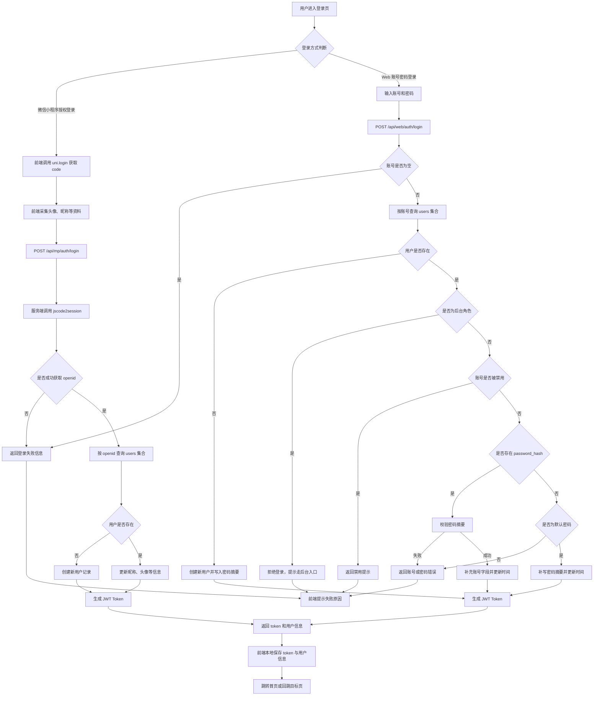

# 图 4-3 用户登录流程实现图

以下流程图依据当前项目实际代码整理，主要对应：

- `uniapp-project/src/services/auth.js`
- `admin/routes/mp-auth.js`
- `admin/routes/web-auth.js`

## Mermaid 版

## 论文配图说明

图 4-3 展示了系统用户登录功能的实现流程。系统支持微信小程序授权登录和 Web 账号密码登录两种方式。小程序端先通过 `uni.login` 获取临时登录凭证 `code`，服务端再调用微信接口换取 `openid`，并完成用户查询、注册或信息更新，最后生成 JWT 令牌返回前端。Web 端则通过账号密码调用登录接口，服务端完成账号校验、状态检查、密码摘要验证及令牌签发，登录成功后由前端保存令牌并跳转到目标页面。
