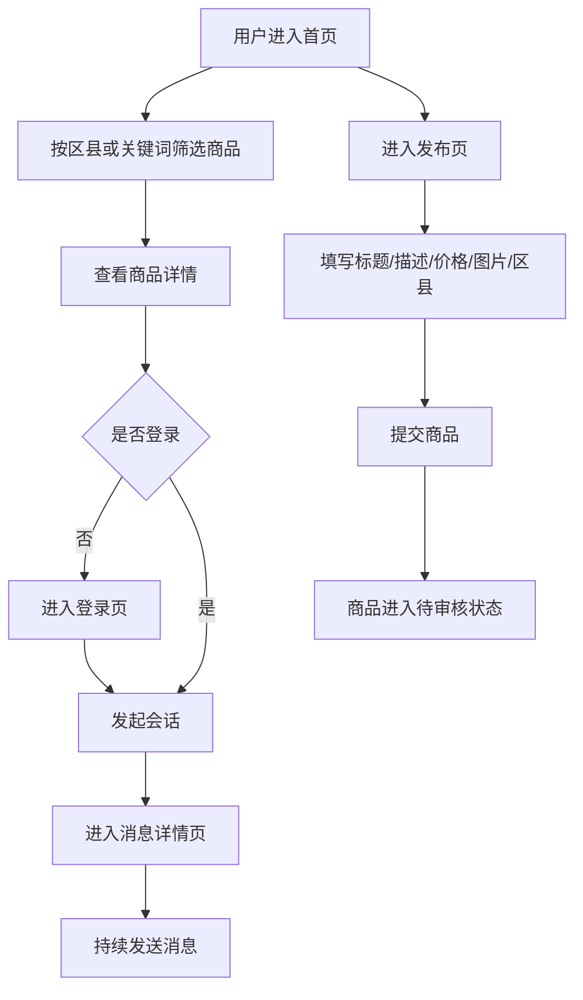
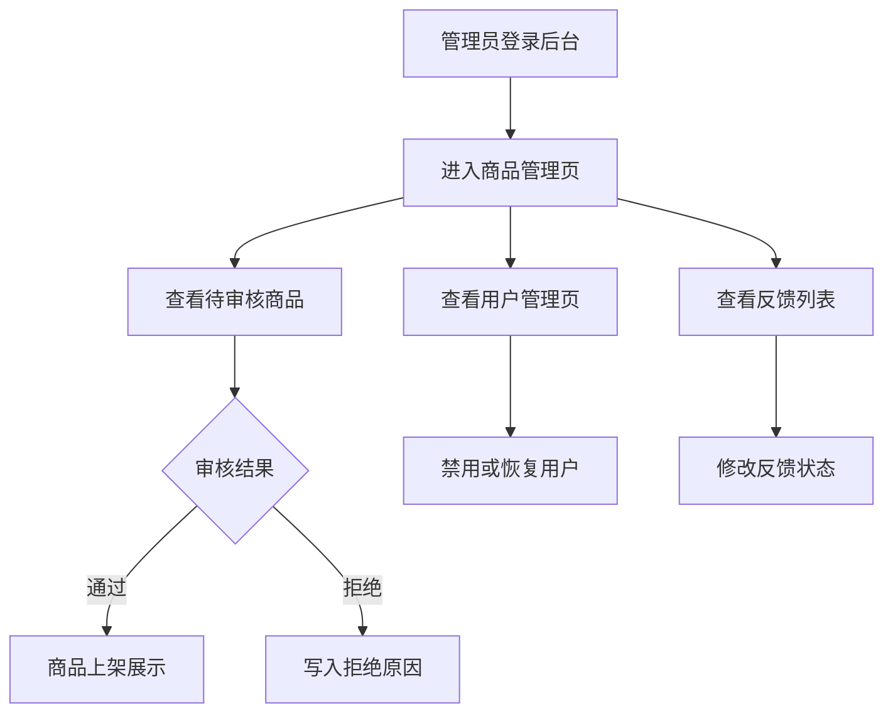
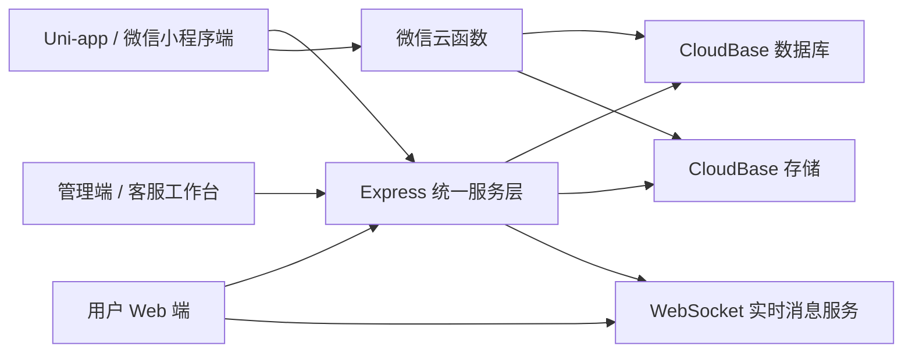
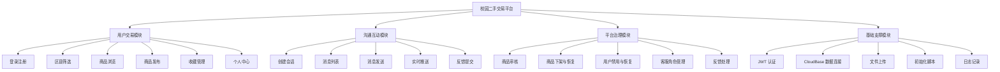
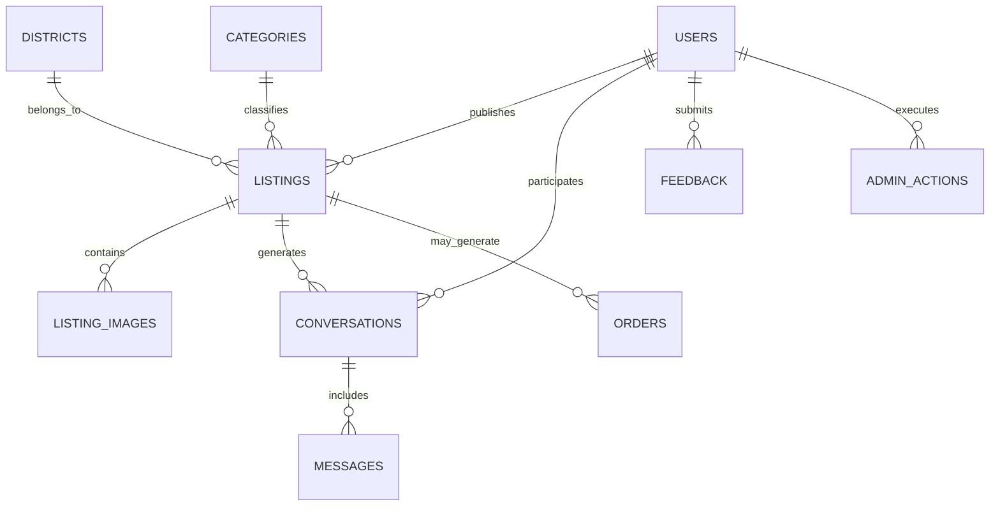
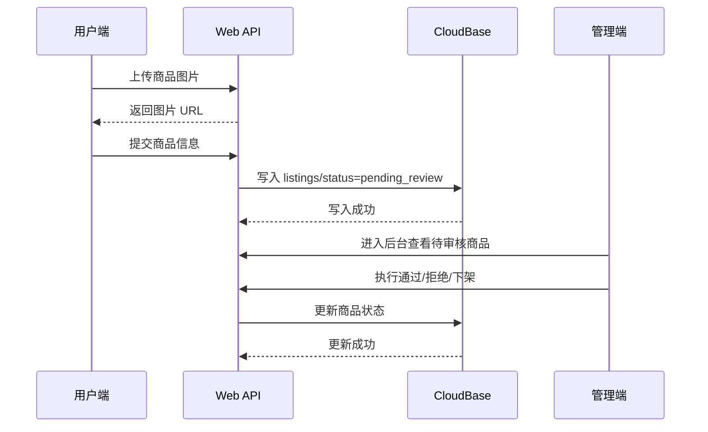

# 学科分类号：TP311.5

# 本科毕业设计（论文）

题    目：基于微信云开发的校园二手交易平台多端系统的设计与实现  
学    院：信息技术学院  
年级专业：22级软件工程  
学 生 姓 名：朱鑫  
学    号：2212406010240  
指 导 教 师：欧大武  
完成时间：2026年4月  

---

# 广东理工学院本科毕业设计（论文）

# 基于微信云开发的校园二手交易平台多端系统的设计与实现

Design and Implementation of a Multi-end Campus Second-hand Trading Platform Based on WeChat CloudBase

学生姓名：朱鑫  
指导教师：欧大武  
2026年4月  
April 2026  

---

# 毕业设计（论文）诚信声明

本人郑重声明：所呈交的毕业设计（论文）是在指导教师指导下独立完成的研究成果。除文中已经标注引用的内容外，本文不包含任何他人已经发表或撰写过的研究成果，也不包含为获得广东理工学院或其他教育机构学位、学历而使用过的材料。对本文研究工作做出贡献的个人和集体，均已在文中以明确方式说明。本人完全意识到本声明的法律后果由本人承担。

毕业设计（论文）作者签名：__________  
日 期：____年__月__日

---

# 摘要

随着高校学生闲置物品数量的不断增加，校园内部的二手交易需求日益明显。教材、数码设备、宿舍用品和生活电器等物品在学生毕业、换宿舍、课程结束或设备升级后形成了大量闲置资源。传统的校园二手交易方式主要依赖微信群、QQ群、表白墙和线下摆摊，虽然具备一定的即时性，但普遍存在信息分散、搜索效率低、缺乏统一审核、买卖沟通链路分裂以及交易记录难追溯等问题，难以满足高校场景下对便捷性、安全性和规范性的要求。

针对上述问题，本文结合 `g:/bishe2` 项目的实际实现，设计并完成了一套基于微信云开发的校园二手交易平台多端系统。系统采用“Uni-app/微信小程序端 + 用户 Web 端 + 管理端 Web + 客服工作台”的多端协同模式，底层以 CloudBase 作为数据资源基础，辅以 Node.js、Express、EJS、Vue 和 WebSocket 等技术完成统一服务治理。系统围绕普通用户、管理员和客服三类角色展开，构建了用户登录、区县筛选、商品浏览、商品发布、收藏管理、站内会话、消息发送、反馈提交、后台审核、用户禁用和客服处理等核心功能。

在系统设计方面，本文对需求分析、功能结构、数据库模型、接口规范和安全机制进行了系统阐述。数据库采用文档型结构，围绕 `users`、`districts`、`categories`、`listings`、`listing_images`、`conversations`、`messages`、`feedback`、`admin_actions` 和 `orders` 等集合组织业务数据。为了提高系统的安全性与可用性，平台在实现中引入了 JWT 认证、基于 `pbkdf2` 的密码摘要、文件上传白名单、用户状态校验和 WebSocket 实时消息机制。

从项目当前实现结果来看，系统已经具备完整的最小交易闭环，能够支持“发布商品 - 审核上架 - 浏览详情 - 发起沟通 - 后台治理”的核心业务流程。研究与实践表明，基于微信云开发和轻量化 Node.js 服务的混合架构，能够较好地兼顾开发效率、部署成本和后续扩展性，对校园场景下的本地二手交易平台建设具有一定的参考价值。

关键词：微信云开发；校园二手交易；Uni-app；Web 管理端；WebSocket；多端系统

---

# ABSTRACT

With the increasing amount of idle goods among college students, the demand for second-hand trading within campuses has become increasingly prominent. Books, digital devices, dormitory supplies and household appliances often become idle after graduation, dormitory relocation, course completion or device replacement. Traditional campus trading approaches mainly rely on WeChat groups, online community posts and offline stalls. Although these methods are convenient to some extent, they usually suffer from scattered information, low retrieval efficiency, lack of unified review, fragmented communication channels and poor traceability of transaction records.

To solve these problems, this paper designs and implements a multi-end campus second-hand trading platform based on the actual project in `g:/bishe2`. The system adopts a collaborative architecture including a Uni-app/WeChat mini-program client, a user-facing Web client, a Web-based admin system and a customer-service dashboard. CloudBase is used as the underlying data service, while Node.js, Express, EJS, Vue and WebSocket are employed to build the unified service layer. The platform is designed for three main roles: normal users, administrators and customer-service staff, and provides core functions such as login, district-based filtering, listing browsing, listing publishing, favorites management, in-site conversations, message sending, feedback submission, backend review, user disabling and service processing.

In terms of system design, this paper elaborates the requirements analysis, functional architecture, database schema, API specification and security mechanisms. A document-oriented database model is adopted, with key collections including `users`, `districts`, `categories`, `listings`, `listing_images`, `conversations`, `messages`, `feedback`, `admin_actions` and `orders`. To improve security and usability, the implementation introduces JWT authentication, password hashing based on `pbkdf2`, upload whitelist control, user-state validation and WebSocket-based real-time message delivery.

According to the current implementation, the system has formed a complete minimum transaction closed loop and is able to support the core process of “listing publication - backend review - detail browsing - conversation initiation - platform governance”. The study shows that the hybrid solution based on WeChat CloudBase and lightweight Node.js services can effectively balance development efficiency, deployment cost and future extensibility, which provides practical reference for building localized campus second-hand trading platforms.

Key words: WeChat CloudBase; campus second-hand trading; Uni-app; Web admin; WebSocket; multi-end system

---

# 目 录

第1章 绪论  
1.1 研究背景  
1.2 国内外研究现状  
1.3 研究内容与研究方法  
1.4 论文结构安排  

第2章 系统需求分析  
2.1 可行性分析  
2.2 角色与业务流程分析  
2.3 功能需求分析  
2.4 非功能需求分析  
2.5 项目文件结构梳理  

第3章 系统设计  
3.1 系统总体架构设计  
3.2 功能结构设计  
3.3 数据库设计  
3.4 接口设计  
3.5 系统安全设计  

第4章 系统实现  
4.1 开发环境与关键技术落地  
4.2 用户 Web 端实现  
4.3 Uni-app 与微信小程序端实现  
4.4 管理端实现  
4.5 客服工作台实现  
4.6 关键业务流程实现  

第5章 系统测试  
5.1 测试环境与测试方法  
5.2 功能测试用例设计  
5.3 接口与安全测试分析  
5.4 兼容性与性能测试分析  
5.5 测试结果总结  

结论  
参考文献  
致谢

---

# 第1章 绪论

## 1.1 研究背景

随着移动互联网和电子商务的发展，二手交易逐渐成为资源再利用的重要方式。对于高校场景而言，学生群体具有明显的阶段性消费特征：每到毕业季、换宿舍时期、考试结束或数码设备更新时，大量教材、学习资料、电子产品、宿舍收纳用品和生活电器会转化为闲置物品。若缺乏高效的交易渠道，这些资源往往只能被低价处理甚至直接丢弃，从而造成资源浪费。

当前校园二手交易多依赖微信群、QQ群、朋友圈转发、贴吧或线下跳蚤市场等方式完成。上述方式虽然成本较低，但存在以下几个典型问题：

1. 商品信息分散，缺少统一的展示与搜索入口。
2. 发布内容格式不一，筛选成本较高。
3. 平台缺乏审核机制，存在虚假信息和违规内容风险。
4. 买卖双方通常需要跳转到外部社交工具沟通，消息链路不统一。
5. 用户反馈、违规处理与后台治理能力薄弱，难以支撑持续运营。

微信小程序与云开发技术的发展为校园本地化交易平台建设提供了新的思路。微信小程序具备“即用即走、入口便捷、依附社交生态”的优势，而 CloudBase 提供了云数据库、云函数和云存储等能力，可以显著降低后端基础设施的搭建成本[1-3]。与此同时，Web 技术栈在后台管理、运营工作台与浏览器端访问方面具有成熟优势。因此，将微信云开发与 Web 服务结合起来，构建适配校园场景的多端二手交易平台，具有较强的现实价值与工程意义。

## 1.2 国内外研究现状

### 1.2.1 国外研究现状

国外二手交易平台的发展较早，已经形成较成熟的 C2C 生态。以 eBay、Craigslist 为代表的早期平台主要强调在线信息展示、分类检索和基础信誉机制；近年来，以 Facebook Marketplace 为代表的社交化平台开始强调本地化交易和邻里关系嵌入，通过缩短买卖双方的物理距离提升交易效率与信任水平。国外相关平台的成功经验表明，地理邻近性、社交联系和信息透明度，是提升二手交易成功率的重要因素。

在研究层面，国外对二手交易平台的关注重点主要集中于用户信任构建、信息不对称缓解、地理位置服务与平台推荐机制等方面。尤其在高频的本地二手场景中，平台往往通过信用展示、历史记录、即时沟通与当面交易结合的方式降低风险。这些研究为校园与社区类二手平台建设提供了借鉴。

### 1.2.2 国内研究现状

国内二手交易市场近年来快速发展，综合类平台如闲鱼、转转已经形成较大的用户规模，但其服务对象面向全社会，难以充分适应校园内部用户对“近距离、可信任、可面交、低物流成本”的交易特点。因而，围绕校园和社区场景构建垂直二手交易平台逐渐成为研究热点。

赵俊杰等针对校园二手书交易场景开展研究，提出基于微信小程序与云开发技术构建交易平台，以解决校园教材与书籍重复购买、信息获取困难等问题[9]。孙丽等则从平台运营角度，对基于微信小程序的大学校园二手交易平台构建与推广进行了研究，指出校园内部二手交易除了系统建设本身，还需要完善的运营机制和治理策略支撑[10]。总体来看，国内关于校园二手平台的研究已经从早期的单纯页面实现，逐步转向“系统建设 + 场景运营 + 用户体验 + 平台治理”的综合研究方向。

### 1.2.3 现有研究存在的问题

通过对现有相关研究与案例的分析，可以发现以下不足：

1. 许多研究仅聚焦小程序单端实现，缺少管理端与运营端支撑。
2. 一部分系统偏重商品展示，忽略了审核、反馈和用户治理机制。
3. 即时沟通能力较弱，往往仍需跳转外部社交工具。
4. 系统架构说明多停留在概念层面，缺少与真实工程代码相对应的实现细节。

因此，本文在校园二手场景下，尝试构建一套兼具用户端、管理端、客服端和多终端接入能力的完整系统，并以真实仓库实现作为基础展开论述。

## 1.3 研究内容与研究方法

### 1.3.1 研究内容

本文围绕校园二手交易平台的设计与实现，完成以下研究内容：

1. 分析校园二手交易平台的业务场景、角色分工与核心需求。
2. 设计多端系统总体架构，明确 Uni-app 端、用户 Web 端、管理端与客服工作台的协同关系。
3. 设计文档型数据库结构，完成用户、商品、消息、反馈、管理动作等核心数据模型。
4. 实现商品发布、商品审核、收藏、会话聊天、反馈处理和角色控制等功能。
5. 对系统进行测试用例设计，并对当前实现结果与存在问题进行总结分析。

### 1.3.2 研究方法

本文主要采用以下研究方法：

1. 文献研究法：查阅微信小程序、云开发、校园交易平台和 Web 系统设计相关资料，为系统建设提供理论依据。
2. 系统分析法：从角色、流程、模块和数据结构角度梳理业务需求，形成平台设计方案。
3. 原型实现法：结合真实代码仓库，完成前端、后端和数据库结构实现。
4. 功能验证法：依据业务流程设计测试用例，对平台的核心闭环进行分析。

## 1.4 论文结构安排

本文共分为五章，外加结论、参考文献和致谢部分。

1. 第1章为绪论，介绍研究背景、研究现状、研究内容与论文安排。
2. 第2章为系统需求分析，完成可行性分析、角色分析、功能需求与项目结构梳理。
3. 第3章为系统设计，围绕总体架构、功能结构、数据库设计、接口设计与安全机制展开。
4. 第4章为系统实现，结合项目目录说明用户 Web 端、Uni-app 端、管理端、客服端和关键流程的落地情况。
5. 第5章为系统测试，给出测试环境、测试用例和结果分析。

---

# 第2章 系统需求分析

## 2.1 可行性分析

### 2.1.1 技术可行性

项目当前采用的技术体系较为成熟。前端使用 Uni-app 和 Vue，后端使用 Node.js 与 Express，管理端采用 EJS 模板渲染，底层数据服务对接 CloudBase，消息模块借助 WebSocket 完成实时通知。这些技术均具有成熟文档与广泛社区支持[1-8]，能够满足校园二手交易平台的开发要求。

此外，项目实现中已经包含基础脚本和初始化工具，如 `init-db.js`、`seed-test-data.js`、`query-users.js` 和 `set-admin-role.js`，说明系统具备较好的工程落地基础。因此，从技术路线角度看，本课题具备较高的可行性。

### 2.1.2 经济可行性

校园二手平台的目标用户范围相对集中，访问量通常低于大型综合电商平台。采用微信云开发与轻量 Express 服务的组合方案，可以避免传统高成本服务器与复杂中间件集群的前期投入，降低平台开发和部署成本。对于毕业设计或校内原型系统而言，这种技术路径具有较好的成本优势。

### 2.1.3 操作可行性

目标用户为在校学生和学校管理人员，他们对移动端和 Web 页面具有较高接受度。小程序与 Web 界面操作路径相对清晰，系统核心动作包括登录、浏览、发布、聊天和审核，学习成本较低。同时，后台管理界面采用表格式页面和按钮式操作，适用于教师或学生管理员使用。因此系统在操作层面具有较好的可行性。

## 2.2 角色与业务流程分析

### 2.2.1 角色分析

系统主要包含三类角色：

1. 普通用户：浏览商品、发布商品、收藏、聊天、提交反馈。
2. 管理员：审核商品、下架商品、恢复商品、禁用用户、分配客服角色、处理反馈。
3. 客服人员：查看会话活跃情况、跟进反馈状态、辅助运营处理。

### 2.2.2 用户业务流程分析

用户端核心业务流程如图2-1所示。



### 2.2.3 后台业务流程分析

后台管理流程如图2-2所示。



## 2.3 功能需求分析

### 2.3.1 用户端功能需求

根据项目当前实现，用户端需要满足以下主要需求：

1. 登录注册需求  
   Web 端支持账号密码登录与自动注册；小程序端支持微信授权登录，并可扩展手机号授权能力。

2. 区县筛选需求  
   用户能够按照省、市、区县筛选本地范围内商品，以提高本地交易匹配效率。

3. 商品浏览需求  
   用户能够浏览已审核商品，查看标题、价格、图片、卖家信息和发布时间。

4. 商品发布需求  
   用户能够发布出售帖或求购帖，填写标题、描述、价格、分类、区县并上传图片。

5. 收藏管理需求  
   用户能够将感兴趣的商品加入收藏，并在个人中心快速回访。

6. 会话消息需求  
   用户能够针对某件商品发起会话，在站内发送文本或图片消息，并查看历史消息。

7. 个人中心需求  
   用户能够查看我的帖子、我的消息、我的收藏以及账号基本信息。

8. 反馈提交需求  
   用户能够向平台提交 bug、建议或投诉等反馈信息。

### 2.3.2 管理端功能需求

管理端主要承担平台治理责任，功能需求如下：

1. 后台登录与权限控制。
2. 商品列表展示与详情查看。
3. 商品拒绝、下架、恢复等状态控制。
4. 用户禁用、恢复和客服角色设置。
5. 反馈列表查看与状态处理。
6. 管理动作日志写入与留痕。

### 2.3.3 客服工作台功能需求

客服工作台相较管理员后台更偏向运营支持，主要需求包括：

1. 查看近期活跃会话与消息数量。
2. 查看待处理反馈并更新状态。
3. 辅助处理平台运行中的人工问题。

## 2.4 非功能需求分析

结合校园场景和项目实现情况，系统非功能需求主要包括以下几个方面。

### 2.4.1 性能需求

1. 商品列表加载应保持较快响应。
2. 会话详情与消息发送应具备较好的交互流畅性。
3. 日常校园场景下能够支撑中小规模并发访问。

### 2.4.2 安全需求

1. 非登录用户不得访问受保护接口。
2. 禁用用户不得继续进行发布和消息操作。
3. 管理员与客服权限必须明确区分。
4. 用户密码不得明文存储。
5. 上传文件必须校验类型与大小。

### 2.4.3 可维护性需求

1. 代码目录结构清晰，便于后续扩展。
2. 业务文档、初始化脚本和测试脚本应保持独立组织。
3. 数据模型应对订单、支付、评价等后续功能留有扩展空间。

### 2.4.4 兼容性需求

1. 支持浏览器访问的用户 Web 端。
2. 支持微信小程序端。
3. 支持后台和客服工作台在桌面浏览器中使用。

## 2.5 项目文件结构梳理

本文所依据的项目仓库位于 `g:/bishe2`，经过梳理后，可将核心内容划分为四个部分：运行主体、数据与脚本、设计文档和参考资源。

### 2.5.1 根目录结构

| 路径 | 功能说明 |
| --- | --- |
| `package.json` | 根级脚本入口 |
| `cloudbase.js` | CloudBase SDK 初始化 |
| `init-db.js` | 集合创建与基础数据导入 |
| `seed-test-data.js` | 注入测试数据 |
| `query-users.js` | 查询用户信息 |
| `set-admin-role.js` | 配置管理员权限 |
| `scripts/crawl-china-districts.js` | 区县数据抓取脚本 |
| `data/china-districts.generated.js` | 区县静态数据 |

### 2.5.2 管理端与统一服务目录

`admin` 目录是系统当前的主要运行核心，既承载后台管理页面，也承载用户 Web API 和 WebSocket 服务。

| 路径 | 作用 |
| --- | --- |
| `admin/server.js` | Express 服务主入口 |
| `admin/routes/admin.js` | 后台商品、用户、反馈管理路由 |
| `admin/routes/service.js` | 客服工作台路由 |
| `admin/routes/web-auth.js` | 用户 Web 登录认证路由 |
| `admin/routes/web-api.js` | 用户 Web 业务接口 |
| `admin/routes/mp-auth.js` | 微信小程序登录接口 |
| `admin/websocket.js` | WebSocket 即时消息服务 |
| `admin/views/*` | EJS 页面模板 |
| `admin/public/user-web/*` | 用户 Web 端前端资源 |

### 2.5.3 Uni-app 目录

`uniapp-project` 为小程序和跨端前端目录，其主要结构如下：

| 路径 | 作用 |
| --- | --- |
| `uniapp-project/src/pages/*` | 首页、分类、详情、发布、消息、收藏、我的、登录页面 |
| `uniapp-project/src/services/api.js` | API 封装与多模式数据接入 |
| `uniapp-project/src/services/auth.js` | 小程序与测试登录逻辑 |
| `uniapp-project/src/utils/cloudbase.js` | 小程序端 CloudBase 初始化 |
| `uniapp-project/cloudfunctions/weixinAuthLogin` | 微信授权登录云函数 |
| `uniapp-project/src/pages.json` | 页面路由与 tabBar 配置 |

### 2.5.4 文档与参考资源说明

项目中 `docs/mvp` 目录包含页面清单、数据模型和接口设计说明；`docs/execution/outputs` 包含架构与执行过程文档。这些文档为系统设计论述提供了较直接的支撑。

需要说明的是，`admin/temp_crmeb` 目录虽然体量较大，但更接近外部参考商城工程，不属于当前项目实际运行核心。因此本文将其视为参考资源，不作为主要实现对象展开。

---

# 第3章 系统设计

## 3.1 系统总体架构设计

结合项目实际实现，系统整体采用“多端接入 + 统一服务入口 + CloudBase 数据底座”的总体架构。系统既保留了微信小程序场景下的云开发优势，也通过 Express 服务实现了用户 Web 端、管理端与客服工作台的统一管理。

系统总体架构如图3-1所示。



在该架构下：

1. 用户可以通过小程序端或浏览器端进入系统。
2. 管理员和客服通过后台 Web 页面完成治理与运营操作。
3. 数据统一写入 CloudBase，保持业务实体一致性。
4. 会话消息在数据库持久化的基础上，通过 WebSocket 提供实时推送能力。

## 3.2 功能结构设计

系统从功能角度可以划分为四个层次模块：用户交易模块、沟通互动模块、平台治理模块和基础支撑模块。



## 3.3 数据库设计

### 3.3.1 数据库设计原则

系统数据库设计遵循以下原则：

1. 只保留支撑核心闭环的必要字段，避免过度设计。
2. 优先适配 CloudBase 文档型数据库的 JSON 结构。
3. 使用统一的 `id` 与 `_id` 兼容策略，便于多端访问。
4. 为订单、支付、评价等后续扩展预留字段和集合。

### 3.3.2 实体关系设计

系统主要实体关系如图3-2所示。



### 3.3.3 核心集合设计

#### （1）用户集合 `users`

| 字段名 | 类型 | 说明 |
| --- | --- | --- |
| `id` | String | 业务用户编号 |
| `openid` / `open_id` | String | 微信或平台唯一标识 |
| `username` / `account` | String | Web 端账号 |
| `nickname` | String | 用户昵称 |
| `avatar_url` | String | 用户头像 |
| `role` | String | `user`、`admin`、`customer_service` |
| `status` | String | `active` 或 `disabled` |
| `phone_number` | String | 手机号 |
| `phone_verified` | Boolean | 是否完成手机号验证 |
| `password_hash` | String | 密码哈希 |
| `password_salt` | String | 密码盐值 |
| `favorite_listing_ids` | Array | 收藏商品列表 |
| `created_at` | Number/Date | 创建时间 |
| `updated_at` | Number/Date | 更新时间 |

#### （2）区县集合 `districts`

| 字段名 | 类型 | 说明 |
| --- | --- | --- |
| `id` | String | 文档编号 |
| `code` | String | 区县编码 |
| `name` | String | 区县名称 |
| `city_code` | String | 城市编码 |
| `city_name` | String | 城市名称 |
| `province_code` | String | 省编码 |
| `province_name` | String | 省名称 |
| `district_type` | String | 区划类型 |
| `is_active` | Boolean | 是否启用 |
| `sort_order` | Number | 排序 |

#### （3）分类集合 `categories`

| 字段名 | 类型 | 说明 |
| --- | --- | --- |
| `id` | String | 分类编号 |
| `name` | String | 分类名称 |
| `icon` | String | 图标 |
| `parent_id` | String | 父级分类 |
| `is_active` | Boolean | 是否启用 |
| `sort_order` | Number | 排序 |
| `description` | String | 分类说明 |

#### （4）商品集合 `listings`

| 字段名 | 类型 | 说明 |
| --- | --- | --- |
| `id` | String | 商品业务编号 |
| `openid` / `open_id` | String | 发布者标识 |
| `title` | String | 商品标题 |
| `description` | String | 商品描述 |
| `price` | Number | 商品价格 |
| `district_code` | String | 区县编码 |
| `city_code` | String | 城市编码 |
| `province_code` | String | 省份编码 |
| `category_id` | String | 分类编号 |
| `listing_type` | String | `sale` 或 `wanted` |
| `status` | String | `pending_review`、`approved`、`rejected`、`off_shelf` 等 |
| `review_status` | String | 审核状态 |
| `reject_reason` | String | 驳回原因 |
| `image_urls` | Array | 商品图片地址列表 |
| `cover_image_url` | String | 封面图 |
| `view_count` | Number | 浏览量 |
| `contact_count` | Number | 联系次数 |
| `created_at` | Number | 创建时间 |
| `updated_at` | Number | 更新时间 |

#### （5）商品图片集合 `listing_images`

| 字段名 | 类型 | 说明 |
| --- | --- | --- |
| `id` | String | 图片编号 |
| `listing_id` | String | 商品编号 |
| `image_url` | String | 图片地址 |
| `sort_order` / `order` | Number | 排序 |
| `created_at` | Number/Date | 创建时间 |

#### （6）收藏集合 `favorites`

| 字段名 | 类型 | 说明 |
| --- | --- | --- |
| `id` | String | 收藏业务编号 |
| `openid` | String | 收藏用户唯一标识 |
| `listing_id` | String | 被收藏商品编号 |
| `created_at` | Number/Date | 收藏创建时间 |

其中，`users.favorite_listing_ids` 作为冗余字段保存在用户文档中，用于快速判断收藏状态；`favorites` 集合作为关系型中间集合，用于支持多端同步、收藏列表查询和后续统计扩展。

#### （7）会话集合 `conversations`

| 字段名 | 类型 | 说明 |
| --- | --- | --- |
| `id` | String | 会话编号 |
| `listing_id` | String | 关联商品编号 |
| `buyer_openid` | String | 买家标识 |
| `seller_openid` | String | 卖家标识 |
| `last_message` | String | 最后一条消息摘要 |
| `unread_count` | Number | 未读数 |
| `updated_at` | Number | 最近更新时间 |
| `created_at` | Number | 创建时间 |

#### （8）消息集合 `messages`

| 字段名 | 类型 | 说明 |
| --- | --- | --- |
| `id` | String | 消息编号 |
| `conversation_id` | String | 所属会话编号 |
| `sender_openid` | String | 发送者标识 |
| `content` | String | 消息内容 |
| `message_type` | String | `text`、`image`、`order`、`location` |
| `image_url` | String | 图片消息地址 |
| `payload` | Object | 订单或位置等扩展载荷 |
| `status` | String | `sent`、`read` |
| `created_at` | Number | 创建时间 |

#### （9）反馈集合 `feedback`

| 字段名 | 类型 | 说明 |
| --- | --- | --- |
| `id` | String | 反馈编号 |
| `user_id` / `openid` | String | 用户标识 |
| `category` | String | `bug`、`suggestion`、`complaint` 等 |
| `content` | String | 反馈内容 |
| `contact_info` | String | 联系方式 |
| `status` | String | `new`、`processing`、`closed` |
| `created_at` | Number | 创建时间 |
| `updated_at` | Number | 更新时间 |

#### （10）管理操作集合 `admin_actions`

| 字段名 | 类型 | 说明 |
| --- | --- | --- |
| `id` | String | 操作编号 |
| `admin_user_id` | String | 管理员或客服编号 |
| `target_type` | String | `listing`、`user`、`feedback` |
| `target_id` | String | 操作目标编号 |
| `action` | String | 操作类型 |
| `action_note` | String | 备注 |
| `created_at` | Number | 创建时间 |

#### （11）订单集合 `orders`

| 字段名 | 类型 | 说明 |
| --- | --- | --- |
| `order_id` | String | 订单编号 |
| `listing_id` | String | 商品编号 |
| `title` | String | 商品标题 |
| `price` | Number | 订单金额 |
| `status` | String | `pending`、`paid`、`completed`、`cancelled` |
| `buyer_openid` | String | 买家标识 |
| `seller_openid` | String | 卖家标识 |
| `created_at` | Number | 创建时间 |
| `updated_at` | Number | 更新时间 |

### 3.3.4 索引设计说明

根据 `init-db.js` 与设计文档规划，系统主要索引方向如下：

1. `users`：`openid/open_id + status`
2. `districts`：`city_code + is_active`
3. `categories`：`parent_id + sort_order`
4. `listings`：`status + district_code + created_at`
5. `listing_images`：`listing_id + sort_order`
6. `favorites`：`openid + listing_id`
7. `conversations`：`buyer_openid + updated_at`、`seller_openid + updated_at`
8. `messages`：`conversation_id + created_at`
9. `feedback`：`created_at`
10. `orders`：`order_id + status`

## 3.4 接口设计

### 3.4.1 用户认证接口设计

| 接口 | 方法 | 功能说明 |
| --- | --- | --- |
| `/api/web/auth/login` | POST | 用户 Web 登录 |
| `/api/web/auth/register` | POST | 用户 Web 注册 |
| `/api/web/auth/login-with-password` | POST | 密码登录兼容入口 |
| `/api/web/auth/me` | GET | 获取当前登录用户 |
| `/api/mp/auth/login` | POST | 微信小程序授权登录 |
| `/api/mp/auth/phone` | POST | 微信手机号授权 |
| `/api/mp/auth/me` | GET | 获取当前小程序用户 |

### 3.4.2 业务接口设计

| 接口 | 方法 | 功能说明 |
| --- | --- | --- |
| `/api/web/districts` | GET | 获取区县数据 |
| `/api/web/categories` | GET | 获取分类数据 |
| `/api/web/listings` | GET | 获取商品列表 |
| `/api/web/listings/:id` | GET | 获取商品详情 |
| `/api/web/listings` | POST | 发布商品 |
| `/api/web/me/listings` | GET | 获取我的商品 |
| `/api/web/me/listings/:id/status` | PATCH | 更新我的商品状态 |
| `/api/web/favorites` | GET | 获取收藏 ID 列表 |
| `/api/web/favorites/listings` | GET | 获取收藏商品列表 |
| `/api/web/favorites/toggle` | POST | 收藏切换 |
| `/api/web/conversations/open` | POST | 创建或打开会话 |
| `/api/web/conversations` | GET | 获取会话列表 |
| `/api/web/conversations/:id` | GET | 获取会话详情 |
| `/api/web/conversations/:id/messages` | GET | 获取消息列表 |
| `/api/web/conversations/:id/messages` | POST | 发送消息 |
| `/api/web/conversations/:id/read` | POST | 标记已读 |
| `/api/web/uploads/listing` | POST | 商品图片上传 |
| `/api/web/uploads/chat` | POST | 聊天图片上传 |

### 3.4.3 管理接口与页面动作设计

后台和客服侧主要通过表单页面触发管理动作，其核心页面与行为包括：

1. `/admin/listings`：查看商品列表。
2. `/admin/listings/:id/reject`：拒绝商品。
3. `/admin/listings/:id/remove`：下架商品。
4. `/admin/listings/:id/restore`：恢复商品。
5. `/admin/users/:id/disable`：禁用用户。
6. `/admin/users/:id/enable`：恢复用户。
7. `/admin/users/:id/make-service`：设为客服。
8. `/admin/feedback/:id/status`：修改反馈状态。
9. `/service/feedback/:id/status`：客服修改反馈状态。

## 3.5 系统安全设计

### 3.5.1 身份认证设计

用户 Web 端采用 JWT 鉴权，登录成功后生成 `token` 并通过请求头传递；后台管理端采用 Session 保存登录状态。两种机制分别适配 API 场景和服务端渲染页面场景。

### 3.5.2 密码安全设计

Web 用户密码不以明文存储，而是通过随机盐值与 `crypto.pbkdf2Sync` 生成哈希。后台最高管理员和客服口令支持通过环境变量配置，避免生产环境出现默认弱口令风险。

### 3.5.3 角色权限设计

系统以 `role` 字段为核心划分用户权限：

1. `user`：普通用户，仅可访问前台业务接口。
2. `customer_service`：可进入客服工作台处理反馈。
3. `admin`：可进入后台完成全量治理操作。

### 3.5.4 文件上传安全设计

系统使用文件扩展名与 MIME 类型双重校验，只允许 `jpeg`、`jpg`、`png`、`webp`、`gif` 等类型上传，并将单文件大小限制在 10MB 以内，以降低恶意文件写入风险。

### 3.5.5 会话安全设计

WebSocket 建连时必须携带合法 JWT，服务端验签成功后才允许连接并订阅会话频道。只有当前会话参与者才能访问对应消息接口，从而避免越权查看他人聊天数据。

---

# 第4章 系统实现

## 4.1 开发环境与关键技术落地

### 4.1.1 开发环境

根据项目依赖与配置，系统开发环境如表4-1所示。

| 项目 | 环境或技术 |
| --- | --- |
| 服务端语言 | JavaScript |
| 服务端框架 | Express |
| 前端框架 | Vue 3、Uni-app |
| 模板引擎 | EJS |
| 数据服务 | 腾讯云 CloudBase |
| 实时通信 | WebSocket (`ws`) |
| 构建工具 | Vite |
| 身份认证 | JWT、微信授权登录 |
| 运行端 | Web 浏览器、微信小程序 |

### 4.1.2 关键技术落地说明

1. `cloudbase.js` 负责 CloudBase Node SDK 初始化。
2. `admin/server.js` 负责统一挂载后台、用户 Web API、小程序认证和 WebSocket。
3. `uniapp-project/src/services/api.js` 负责多端 API 封装与 Mock/CloudBase/Web 三模式切换。
4. `admin/websocket.js` 负责即时消息推送。
5. `init-db.js` 负责集合初始化、区县与分类数据导入。

## 4.2 用户 Web 端实现

用户 Web 端位于 `admin/public/user-web` 目录，主要由 `index.html`、`app.js` 和 `styles.css` 组成。该部分采用单页应用的组织方式，通过 Vue 和 Vue Router 管理页面状态和跳转。

### 4.2.1 页面结构实现

系统已实现以下前台页面：

1. 首页 `/`
2. 分类页 `/categories`
3. 商品详情页 `/listing/:id`
4. 登录页 `/login`
5. 注册页 `/register`
6. 发布页 `/publish`
7. 会话列表页 `/messages`
8. 会话详情页 `/messages/:id`
9. 个人中心页 `/me`
10. 收藏页 `/favorites`

### 4.2.2 登录实现

登录页通过账号密码方式调用 `/api/web/auth/login` 接口，服务端校验用户账号、密码与状态后，返回 JWT 和用户信息。客户端将令牌保存到本地存储中，并通过路由守卫控制受保护页面访问。

### 4.2.3 首页与分类实现

首页支持轮播说明、区县筛选、分类展示、商品卡片列表和搜索功能。商品列表通过 `/api/web/listings` 拉取，接口支持 `province_code`、`city_code`、`district_code`、`category_id`、`listing_type` 和 `keyword` 等参数，满足多维过滤需求。

分类页则进一步强调分类浏览体验，为用户提供按类别查看商品的能力，与首页共同构成发现入口。

### 4.2.4 发布与收藏实现

发布页支持出售帖与求购帖两种模式。用户需要填写标题、描述、价格、区县、分类，并可上传多张商品图片。图片先通过 `/api/web/uploads/listing` 上传，获取文件 URL 后再提交到 `/api/web/listings` 完成商品创建。商品发布后默认进入待审核状态。

物品收藏功能用于帮助居民暂存感兴趣但暂时不准备立即联系或购买的商品。用户可在商品详情页点击“收藏”按钮完成收藏，也可在“我的收藏”页面查看已收藏商品、取消收藏，并进一步发起与卖家的会话。

#### （1）收藏接口定义

收藏模块的后端接口设计如下表所示，三类接口均要求用户完成登录认证后访问。

| 接口地址 | 方法 | 关键参数 | 返回字段 | 功能说明 |
| --- | --- | --- | --- | --- |
| `/api/web/favorites/toggle` | POST | `listing_id` | `favorited` | 切换指定商品的收藏状态，`true` 表示已收藏，`false` 表示已取消收藏 |
| `/api/web/favorites` | GET | 无 | `listing_ids` | 获取当前用户已收藏商品 ID 列表，用于详情页快速判断按钮状态 |
| `/api/web/favorites/listings` | GET | `page`、`page_size` | `items`、`total`、`listing_ids` | 分页获取收藏商品详情列表，用于“我的收藏”页面展示 |

其中，`/api/web/favorites/toggle` 在服务端会先校验 `listing_id` 非空，再根据商品是否存在决定是否继续处理；若商品不存在，则直接返回错误信息，避免产生无效收藏记录。

#### （2）收藏数据结构设计

收藏功能采用“用户文档冗余字段 + 独立收藏集合”双写方式实现，其核心数据结构如下表所示。

| 存储位置 | 字段名 | 类型 | 说明 |
| --- | --- | --- | --- |
| `users` 集合 | `favorite_listing_ids` | Array<String> | 当前用户收藏商品 ID 列表，用于快速判断某商品是否已被收藏 |
| `favorites` 集合 | `id` | String | 收藏业务编号 |
| `favorites` 集合 | `openid` | String | 收藏用户唯一标识 |
| `favorites` 集合 | `listing_id` | String | 被收藏商品编号 |
| `favorites` 集合 | `created_at` | Number/Date | 收藏创建时间 |

该设计兼顾了读取效率与扩展性。一方面，详情页可直接利用 `favorite_listing_ids` 快速判断收藏状态；另一方面，`favorites` 集合作为用户与商品之间的关联关系表，更适合进行收藏列表查询、多端同步以及后续收藏量统计。

#### （3）关键代码逻辑说明

收藏功能的关键逻辑主要由 `readFavoriteListingIds`、`toggleFavoriteState` 和 `/api/web/favorites/listings` 三部分组成，其处理流程如下：

1. 商品详情页加载时，前端先读取商品详情接口返回的 `is_favorited` 字段；若当前值不确定，则继续调用 `/api/web/favorites` 获取 `listing_ids`，确保收藏按钮状态与服务端一致。
2. 当用户点击“收藏”按钮时，前端调用 `/api/web/favorites/toggle`，并提交当前商品的 `listing_id`。
3. 服务端在 `toggleFavoriteState` 中先通过 `readFavoriteListingIds` 同时读取 `users.favorite_listing_ids` 与 `favorites` 集合记录，并对两部分结果去重合并。
4. 若目标商品原本未收藏，则将其加入新集合；若原本已收藏，则从集合中删除，得到新的收藏结果 `nextIds`。
5. 服务端先更新 `users` 集合中的 `favorite_listing_ids`，再同步维护 `favorites` 集合中的单条关联记录，从而保证多端读取路径保持一致。
6. “我的收藏”页面通过 `/api/web/favorites/listings` 拉取收藏商品详情列表，前端支持取消收藏和发起聊天，形成“收藏 - 查看 - 联系卖家”的完整闭环。

其核心处理逻辑可概括为如下伪代码：

```js
async function toggleFavoriteState(openid, userId, listingId) {
  const currentIds = await readFavoriteListingIds(openid, userId)
  const nextFavorited = !currentIds.includes(listingId)
  const nextIds = nextFavorited
    ? normalizeIdList([...currentIds, listingId])
    : currentIds.filter((id) => id !== listingId)

  await writeUserFavoriteListingIds(userId, nextIds)
  const existing = await db.collection("favorites")
    .where({ openid, listing_id: listingId })
    .limit(1)
    .get()

  if (existing.data?.[0] && !nextFavorited) {
    await db.collection("favorites").doc(existing.data[0]._id).remove()
  } else if (!existing.data?.[0] && nextFavorited) {
    await db.collection("favorites").add({
      data: { id: createId("favorite"), openid, listing_id: listingId, created_at: Date.now() },
    })
  }

  return nextFavorited
}
```

在前端实现上，商品详情页的 `toggleFavorite()` 方法负责发起收藏切换请求并即时更新按钮状态；收藏页的 `cancelFavorite(item)` 方法则在用户取消收藏后，直接将对应商品从本地列表移除，从而提升界面响应速度与交互流畅性。

## 4.3 Uni-app 与微信小程序端实现

### 4.3.1 页面与路由实现

`uniapp-project/src/pages.json` 中定义了 9 个页面和 5 个 tabBar 入口，包括首页、分类、发布、消息和我的。这与用户 Web 端的主要业务结构保持一致，便于多端复用。

### 4.3.2 多模式数据接入实现

Uni-app 端的一个重要特点是支持三种数据接入模式：

1. Web API 模式：配置 `API_BASE_URL` 后，直接访问统一后端。
2. CloudBase 模式：在微信小程序环境下直接访问云数据库与云存储。
3. Mock 模式：当云能力不可用时，使用本地模拟数据完成演示与调试。

该设计避免了小程序端完全依赖某一种运行环境，有利于开发期联调和答辩演示。

### 4.3.3 微信授权登录实现

`src/services/auth.js` 中封装了微信授权登录流程。客户端通过 `uni.login` 获取 `code`，然后调用 `/api/mp/auth/login` 换取用户信息与令牌。项目中同时保留了 `cloudfunctions/weixinAuthLogin` 云函数实现，说明系统兼顾了统一后端和纯云函数两种接入路径。

### 4.3.4 云开发文件上传实现

在微信小程序环境下，`src/utils/cloudbase.js` 会优先调用 `wx.cloud.uploadFile` 上传商品图片，返回云文件地址并回写业务数据。这体现了微信云开发作为本项目题目基础技术的落地方式。

## 4.4 管理端实现

管理端由 `admin/server.js` 启动后，通过 `express-session` 保存后台登录状态。管理员登录成功后默认跳转到 `/admin/listings` 页面。

### 4.4.1 商品管理实现

`admin/routes/admin.js` 中实现了商品管理的主要逻辑：

1. 按状态、类型和关键词展示商品列表。
2. 进入商品详情页查看图片、卖家和会话统计。
3. 对商品执行拒绝、下架和恢复操作。
4. 将操作记录写入 `admin_actions` 集合。

商品状态变化逻辑与用户前台显示逻辑相互对应，使平台能够形成“发布后待审、审核通过后可见、下架后隐藏”的完整治理链条。

### 4.4.2 用户管理实现

后台用户管理页能够查看用户昵称、账号、角色、状态和发布量信息，并支持以下操作：

1. 禁用账号。
2. 恢复账号。
3. 设置客服角色。
4. 移除客服角色。

由于前台接口在每次鉴权时都会校验用户状态，因此被禁用用户将无法继续访问需要登录的业务接口。

### 4.4.3 反馈管理实现

反馈管理页支持按状态筛选反馈，并可查看反馈详情、关联用户和修改处理状态。反馈处理链路为平台运营和问题收集提供了基础能力。

## 4.5 客服工作台实现

客服工作台位于 `/service/dashboard`，是项目中区别于普通后台的一个特色模块。其主要实现内容包括：

1. 汇总会话数量、消息数量和待处理反馈数。
2. 展示近期活跃会话及其关联商品、买卖双方昵称和区县信息。
3. 展示待处理反馈并允许客服更新状态。

该模块体现了平台从“功能系统”向“运营系统”扩展的思路，使平台具备初步的人工协同处理能力。

## 4.6 关键业务流程实现

### 4.6.1 商品发布与审核流程实现

商品发布与审核流程如图4-1所示。



### 4.6.2 会话与消息流程实现

当用户在商品详情页点击“聊一聊”或“联系卖家”按钮时，前端首先调用 `POST /api/web/conversations/open` 发起会话。若当前商品与买卖双方之间已经存在会话，则系统直接返回既有会话编号；若不存在，则在 `conversations` 集合中新建记录后返回新会话编号，并跳转到聊天详情页。用户还可以通过底部导航栏中的“消息”入口进入会话列表页，系统调用 `GET /api/web/conversations` 按最近更新时间倒序返回当前用户参与的全部会话，从而方便居民快速查看近期沟通记录。

为保证会话建立、历史记录读取和消息交互过程完整闭环，系统围绕聊天功能定义了如下接口。

| 功能 | 接口地址 | 方法 | 关键参数 | 说明 |
| --- | --- | --- | --- | --- |
| 打开或创建会话 | `/api/web/conversations/open` | POST | `listing_id` | 检查是否已有会话，不存在则创建并返回会话编号 |
| 获取会话列表 | `/api/web/conversations` | GET | 无 | 返回当前用户作为买家或卖家参与的会话摘要列表 |
| 获取会话详情 | `/api/web/conversations/:id` | GET | `id` | 返回会话参与者信息及关联商品摘要 |
| 获取历史消息 | `/api/web/conversations/:id/messages` | GET | `id` | 返回按时间正序排列的消息记录 |
| 发送消息 | `/api/web/conversations/:id/messages` | POST | `content`、`message_type`、`image_url`、`payload` | 支持文本、图片、订单和位置消息 |
| 标记已读 | `/api/web/conversations/:id/read` | POST | `id` | 清空未读数并同步已读状态 |
| 聊天图片上传 | `/api/web/uploads/chat` | POST | `image` | 上传聊天图片并返回可访问 URL |

从关键代码实现来看，会话与消息的后端处理流程主要包含以下几步。首先，在创建会话时，服务端会依据 `listing_id` 查找商品记录，提取商品卖家的 `seller_openid` 与当前登录用户的 `buyer_openid`，并阻止“自己给自己发消息”的异常场景；随后以 `listing_id`、`buyer_openid` 和 `seller_openid` 为条件查询 `conversations` 集合，若已存在记录则直接复用，从而避免同一商品下重复创建会话。其次，在加载历史消息时，服务端会校验当前用户是否为该会话的买家或卖家，再从 `messages` 集合中按 `created_at` 升序读取消息，并将当前用户接收但尚未读取的消息异步更新为 `read` 状态。最后，在消息发送阶段，系统会先校验消息类型与内容完整性，再写入 `messages` 集合，并同步更新 `conversations` 集合中的 `last_message`、`unread_count` 和 `updated_at` 字段；写入成功后，服务端调用 `notifyConversationParticipants` 向会话双方广播 `message:new` 事件。用户进入聊天详情页后，前端还会调用 `POST /api/web/conversations/:id/read` 将当前会话未读数清零，并广播 `conversation:read` 事件。

会话与消息的数据模型采用“一条会话对应多条消息”的文档型结构，其中 `conversations` 集合负责保存会话关系和摘要信息，`messages` 集合负责保存具体消息内容。其核心字段如下表所示。

| 集合 | 字段名 | 类型 | 说明 |
| --- | --- | --- | --- |
| `conversations` | `id` | String | 会话业务编号 |
| `conversations` | `listing_id` | String | 关联商品编号 |
| `conversations` | `buyer_openid` | String | 买家唯一标识 |
| `conversations` | `seller_openid` | String | 卖家唯一标识 |
| `conversations` | `last_message` | String | 最后一条消息摘要，用于会话列表预览 |
| `conversations` | `unread_count` | Number | 当前会话未读消息数 |
| `conversations` | `created_at` | Number | 会话创建时间 |
| `conversations` | `updated_at` | Number | 最近活跃时间 |
| `messages` | `id` | String | 消息业务编号 |
| `messages` | `conversation_id` | String | 所属会话编号 |
| `messages` | `sender_openid` | String | 消息发送者标识 |
| `messages` | `content` | String | 文本内容或图片地址 |
| `messages` | `message_type` | String | 消息类型，支持 `text`、`image`、`order`、`location` |
| `messages` | `image_url` | String | 图片消息对应的图片地址 |
| `messages` | `payload` | Object | 订单、位置等扩展业务数据 |
| `messages` | `status` | String | 消息状态，如 `sent`、`read` |
| `messages` | `created_at` | Number | 消息发送时间 |

为提升会话列表查询与历史消息回放效率，系统在数据库初始化阶段还为 `conversations` 集合建立了 `buyer_openid + updated_at`、`seller_openid + updated_at`、`listing_id + buyer_openid` 等索引，并为 `messages` 集合建立了 `conversation_id + created_at` 索引。这些索引能够支撑会话列表按最近活跃时间排序、按会话编号读取消息历史等高频场景。

### 4.6.3 WebSocket 实时推送实现

`admin/websocket.js` 中通过 `ws` 启动 WebSocket 服务。客户端建立连接时需要携带 JWT，服务端验签成功后将连接加入对应 `openid` 的连接集合，并允许其订阅具体会话。系统在消息写入后调用 `notifyConversationParticipants`，按会话参与者和订阅关系推送消息事件，提升聊天实时性。

### 4.6.4 数据初始化实现

系统通过 `init-db.js` 完成以下初始化工作：

1. 创建 `users`、`districts`、`categories`、`listings` 等集合。
2. 导入全国区县数据快照。
3. 导入商品分类数据。
4. 打印集合与索引计划。

该设计有助于在新环境中快速恢复系统运行条件，体现了较好的工程部署意识。

---

# 第5章 系统测试

## 5.1 测试环境与测试方法

### 5.1.1 测试环境

测试工作基于当前仓库结构和脚本设计进行组织。项目中已包含如下代表性测试或联调脚本：

1. `admin/test-login.js`
2. `test-chat-api.js`
3. `test-chat-debug.js`
4. `test-e2e-chat.js`
5. `test-messages-quick.js`
6. `test-upload-flow.js`
7. `admin/public/user-web/app.syntax-check.mjs`

这些文件表明系统开发过程中已经围绕登录、消息、上传和端到端沟通流程进行了专项验证。

### 5.1.2 测试方法

本文采用以下测试方法组织系统测试内容：

1. 功能测试：验证核心页面与主要业务是否可完成。
2. 接口测试：验证接口入参、返回结果与错误提示是否符合预期。
3. 安全测试：验证未登录、越权访问和禁用用户等场景是否被正确拦截。
4. 兼容性测试：验证 Web 与 Uni-app 端主要流程是否保持一致。

## 5.2 功能测试用例设计

### 5.2.1 用户端功能测试

表5-1 用户端功能测试用例

| 编号 | 测试模块 | 测试内容 | 操作步骤 | 预期结果 |
| --- | --- | --- | --- | --- |
| T01 | 登录 | 用户账号密码登录 | 输入有效账号与密码提交 | 返回 token，进入个人中心 |
| T02 | 注册 | 新账号自动注册 | 输入未存在账号与密码登录 | 自动创建普通用户并登录成功 |
| T03 | 区县筛选 | 首页区县切换 | 在首页切换省、市、区县 | 商品列表按所选范围变化 |
| T04 | 商品浏览 | 商品详情查看 | 点击商品卡片进入详情页 | 正确显示标题、价格、图片、卖家信息 |
| T05 | 商品发布 | 发布出售帖 | 填写信息并上传图片后提交 | 商品写入数据库，状态为待审核 |
| T06 | 商品发布 | 发布求购帖 | 选择求购类型并提交 | 商品以 `wanted` 类型保存 |
| T07 | 收藏功能 | 收藏切换 | 在商品详情点击收藏 | 收藏状态改变，收藏页可见 |
| T08 | 会话功能 | 发起会话 | 在详情页点击联系卖家 | 成功创建或打开会话 |
| T09 | 消息功能 | 文本消息发送 | 在聊天框输入文本并发送 | 消息写入数据库并显示在列表中 |
| T10 | 消息功能 | 图片消息发送 | 上传图片后发送 | 图片消息展示成功 |
| T11 | 个人中心 | 查看我的商品 | 进入个人中心 | 正确展示个人发布列表 |
| T12 | 商品管理 | 下架自己的商品 | 在我的商品中执行下架 | 商品状态变为 `off_shelf` |

### 5.2.2 管理端功能测试

表5-2 管理端功能测试用例

| 编号 | 测试模块 | 测试内容 | 操作步骤 | 预期结果 |
| --- | --- | --- | --- | --- |
| T13 | 后台登录 | 管理员登录 | 输入后台账号密码 | 成功进入商品管理页 |
| T14 | 商品审核 | 拒绝商品 | 在商品详情填写原因并拒绝 | 商品状态变为 `rejected` |
| T15 | 商品治理 | 下架商品 | 对已通过商品执行下架 | 商品不再在前台正常展示 |
| T16 | 商品治理 | 恢复商品 | 对下架商品执行恢复 | 商品状态恢复为已通过 |
| T17 | 用户管理 | 禁用用户 | 在用户列表禁用指定账号 | 账号状态变为 `disabled` |
| T18 | 用户管理 | 恢复用户 | 在用户列表恢复账号 | 账号状态恢复为 `active` |
| T19 | 角色管理 | 设为客服 | 对普通用户设置客服角色 | 角色更新为 `customer_service` |
| T20 | 反馈管理 | 更新反馈状态 | 将反馈改为处理中或已关闭 | 状态更新成功并写入日志 |

### 5.2.3 客服工作台测试

表5-3 客服工作台测试用例

| 编号 | 测试模块 | 测试内容 | 操作步骤 | 预期结果 |
| --- | --- | --- | --- | --- |
| T21 | 客服登录 | 客服账号登录 | 使用客服账号进入后台 | 成功进入客服工作台 |
| T22 | 反馈处理 | 处理待办反馈 | 在工作台点击反馈详情并修改状态 | 状态更新成功 |
| T23 | 数据统计 | 查看近期会话和消息数 | 进入客服工作台首页 | 正确展示统计卡片与近期会话 |

## 5.3 接口与安全测试分析

### 5.3.1 接口测试分析

接口测试应重点关注以下内容：

1. 登录接口是否能返回正确的 `token` 和用户结构。
2. 商品接口是否能按照条件正确分页与筛选。
3. 会话接口是否能根据商品和用户关系复用已有会话。
4. 消息接口是否能正确写入文本、图片和扩展载荷类型消息。
5. 上传接口是否能正确返回图片 URL。

### 5.3.2 安全测试分析

表5-4 安全测试用例

| 编号 | 测试场景 | 操作方式 | 预期结果 |
| --- | --- | --- | --- |
| S01 | 未登录访问受保护接口 | 直接调用 `/api/web/me/listings` | 返回 401 或跳转登录 |
| S02 | 普通用户访问后台 | 使用前台账号访问 `/admin/listings` | 被拒绝访问 |
| S03 | 禁用用户继续操作 | 用禁用账号发送消息或发布商品 | 返回 403，操作失败 |
| S04 | 非法文件上传 | 上传非图片格式文件 | 服务端拒绝上传 |
| S05 | 超大文件上传 | 上传超过 10MB 文件 | 服务端返回大小限制错误 |
| S06 | 越权查看会话 | 非会话参与者访问会话消息接口 | 返回 403 |
| S07 | WebSocket 伪造连接 | 不带 token 或使用无效 token 建连 | 连接被关闭 |

## 5.4 兼容性与性能测试分析

### 5.4.1 兼容性分析

从当前实现来看，系统兼容性主要体现在：

1. Web 端用户可直接通过浏览器访问 `admin/public/user-web` 所承载的前台系统。
2. Uni-app 端可在微信小程序环境中使用云开发能力。
3. 小程序端与 Web 端在页面结构和业务模块上保持基本一致，便于功能迁移。

### 5.4.2 性能分析

由于系统主要面向校园本地场景，性能需求不以高并发极限为目标，而是强调日常访问下的稳定可用。从当前实现机制看，平台采用了以下方式保障基础性能：

1. 商品和会话列表支持分页或分批查询。
2. 数据模型尽量扁平，减少复杂联表开销。
3. 图片资源分离存储，避免大对象频繁进入业务集合。
4. 即时消息通过 WebSocket 推送，降低纯轮询带来的重复请求成本。

### 5.4.3 仍需进一步验证的内容

尽管系统功能完整，但以下测试仍可在后续完善：

1. 更严格的并发访问压测。
2. 多浏览器兼容性细节验证。
3. 小程序真机环境下的弱网测试。
4. 大量图片上传与长会话消息场景验证。

## 5.5 测试结果总结

综合系统实现与测试用例设计可以看出，平台已经较完整地覆盖了校园二手交易的主要业务路径。用户端已形成“登录 - 浏览 - 发布 - 收藏 - 沟通”的闭环；后台已具备“审核 - 下架 - 用户治理 - 反馈处理”的治理能力；客服工作台则进一步补充了平台运营支持。

总体而言，系统具备较好的原型可用性和工程完整性，能够支撑校园二手交易平台的毕业设计课题要求。但在订单闭环、支付能力、推荐机制、精细化运营与性能测试方面，仍有进一步优化空间。

---

# 结论

本文结合校园二手交易场景与 `g:/bishe2` 项目的实际实现，设计并完成了一套基于微信云开发的校园二手交易平台多端系统。系统以“Uni-app/微信小程序端 + 用户 Web 端 + 管理端 Web + 客服工作台”为总体形态，以 CloudBase 作为数据基础设施，以 Express 为统一服务入口，围绕用户交易、后台审核、会话沟通和平台治理构建了较完整的最小业务闭环。

从设计角度看，本文完成了角色需求分析、功能结构划分、数据库建模、接口设计和安全机制设计；从实现角度看，本文落地了登录注册、区县筛选、商品浏览、商品发布、收藏管理、会话消息、后台审核、用户禁用、反馈处理和客服统计等核心模块；从测试角度看，本文构建了较为完整的测试用例体系，能够对系统关键流程进行支撑性验证。

本课题的实现表明，基于微信云开发与轻量 Node.js 服务相结合的方案，能够在较低开发和部署成本下完成校园场景二手交易平台的快速构建，具有较好的实用价值和扩展潜力。未来可在以下方向继续深化：

1. 完善订单支付、交易确认与评价机制。
2. 增加举报、信用分和实名校验等平台治理能力。
3. 引入推荐与搜索优化，提高商品匹配效率。
4. 完善真机、小程序弱网和多终端兼容性测试。
5. 将系统进一步向真实校园运营场景推广验证。

---

# 参考文献

[1] DCloud. uni-app 简介[EB/OL]. https://uniapp.dcloud.net.cn/, 2026-03-16.  
[2] 腾讯云. 云开发 CloudBase 快速开始[EB/OL]. https://cloud.tencent.com/document/product/876/51931, 2026-03-16.  
[3] 腾讯云. 云开发 CloudBase 概述[EB/OL]. https://cloud.tencent.com/document/product/876/19369, 2026-03-16.  
[4] Node.js. Node.js Documentation[EB/OL]. https://nodejs.org/api/index.html, 2026-03-16.  
[5] Express.js. Installing Express[EB/OL]. https://expressjs.com/en/starter/installing.html, 2026-03-16.  
[6] EJS. EJS -- Embedded JavaScript templates[EB/OL]. https://ejs.co/, 2026-03-16.  
[7] Vue.js. Introduction[EB/OL]. https://vuejs.org/guide/introduction.html, 2026-03-16.  
[8] Vue Router. Introduction[EB/OL]. https://router.vuejs.org/introduction.html, 2026-03-16.  
[9] 赵俊杰, 葛敬军, 朱文婷. 基于微信小程序的校园二手书交易平台的设计与实现[J]. 科技与创新, 2024(09):7-11. DOI:10.15913/j.cnki.kjycx.2024.09.002.  
[10] 孙丽, 王皓, 戴璐, 等. 大学校园二手交易平台构建与运营: 以E大学“花梨闲转”微信小程序为例[J]. 科技与创新, 2024(04):12-16.  

---

# 致谢

本论文的完成离不开指导教师欧大武老师在课题选题、技术路线、系统实现和论文撰写过程中的悉心指导。老师在开发思路梳理、结构安排和论文修改方面给予了我大量帮助，使我能够从单纯的功能实现逐步提升到系统化设计与总结的层面，在此表示衷心感谢。

同时，感谢学院老师在毕业设计各阶段提供的支持与建议，感谢同学们在项目开发、问题讨论和测试体验中的帮助。正是在不断交流、反复调试和持续完善的过程中，我对微信云开发、多端协同、后台治理与系统工程实现有了更加深入的理解。

最后，感谢家人对我学习和毕业设计工作的鼓励与支持。今后我将继续保持严谨认真的态度，在软件开发与系统设计的实践中不断提升自己。
